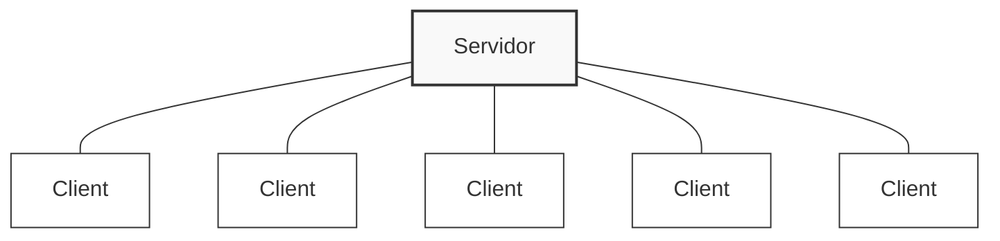
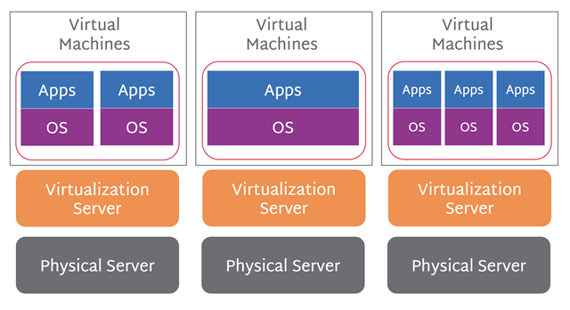
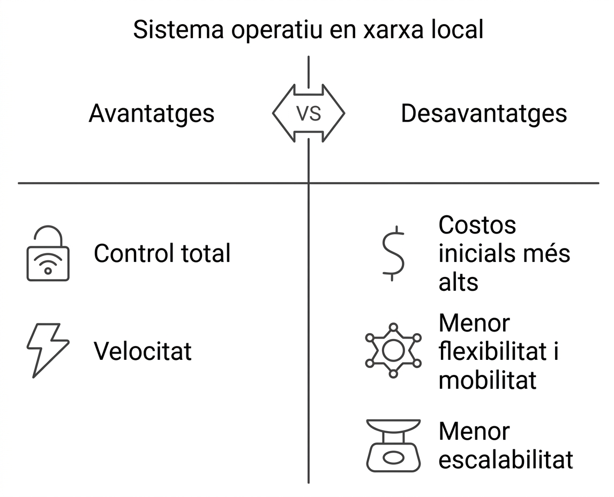
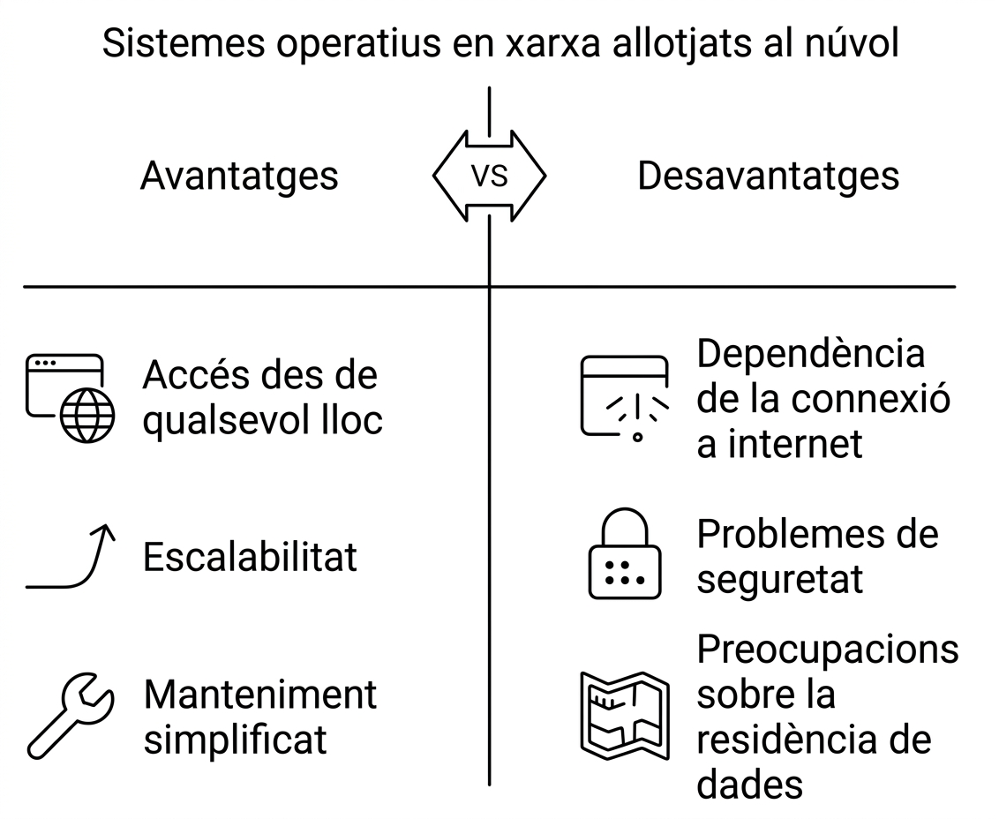

# T0-Introducció als sistemes operatius en xarxa

El curs passat vau veure sistemes operatius al mòdul `Sistemes Operatius Monolloc` i vau observar que si teniu tres equips, heu de configurar els usuaris i els recursos a cadascun dels ordinadors. Això és un problema de gestió quan escalem el problema: trenta, cinquanta, cent... mil equips? Per tant, cal un model on es puguin fer aquestes accions de forma centralitzada.

Un sistema operatiu en xarxa és un sistema operatiu que permet gestionar els recursos d'una xarxa d'ordinadors de manera centralitzada. Les seves funcionalitats principals són:

- Gestió centralitzada d'usuaris i grups.
- Gestió centralitzada de recursos compartits (fitxers, impressores, etc.).
- Crear regles de seguretat i permisos d'accés als recursos.
- Monitorització i control del rendiment de la xarxa.

## Arquitectura d'un sistema operatiu en xarxa

Els sistemes operatius en xarxa poden classificar-se en dues categories principals:

- **Client-Servidor**: En aquest model, un servidor centralitzat gestiona els recursos i els clients (ordinadors de la xarxa) sol·liciten accés a aquests recursos. El servidor és responsable de l'autenticació dels usuaris, la gestió dels fitxers i altres serveis de xarxa.
- **Peer-to-Peer (P2P)**: En aquest model, tots els ordinadors de la xarxa tenen igualtat de condicions i poden compartir recursos directament entre si sense necessitat d'un servidor central. Cada ordinador actua com a client i servidor alhora.

En aquest mòdul aprendrem a configurar un sistema operatiu en xarxa utilitzant el model client-servidor, ja que és el més comú en entorns empresarials i educatius.

### Estructura client-servidor

Es tracta d'una arquitectura on un servidor centralitzat proporciona serveis i recursos als clients de la xarxa. Els components són:

- **Servidor**: És l'ordinador que gestiona els recursos i serveis de la xarxa. Pot ser un servidor de fitxers, un servidor d'impressió, un servidor de correu electrònic, etc.
- **Client**: Són els ordinadors que sol·liciten accés als recursos i serveis proporcionats pel servidor. Els clients poden ser ordinadors de sobretaula, portàtils, dispositius mòbils, etc.

Com a qualsevol model tecnològic, el model client-servidor té avantatges i desavantatges:

- **Avantatges**:

  - Centralització de la gestió: Facilita l'administració dels recursos i usuaris.
  - Seguretat millorada: Permet establir polítiques de seguretat i permisos d'accés.
  - Escalabilitat: És més fàcil afegir nous clients a la xarxa sense afectar el rendiment del servidor.

- **Inconvenients**:

  - Dependència del servidor: Si el servidor falla, els clients poden perdre l'accés als recursos.
  - Bottlenecks: la concentració de recursos en un únic servidor pot provocar colls d'ampolla si no es gestiona correctament la càrrega.
  - Complexitat: Requereix coneixements tècnics per configurar i administrar correctament el sistema, tot i que després de la configuració inicial, la gestió és més senzilla que en un entorn de màquines independents.

Els inconvenients són força més petits que els avantatges i es poden solucionar amb alta disponibilitat (redundància).

## Sistemes operatius en xarxa més comuns

Els sistemes operatius de client avui dia ja estan preparats per treballar en xarxa, però els sistemes operatius de servidor són els que ofereixen les funcionalitats de gestió centralitzada. Alguns dels sistemes operatius en xarxa més comuns són:

- **Windows Server**: Desenvolupat per Microsoft, és un dels sistemes operatius de servidor més utilitzats en entorns empresarials. Ofereix una àmplia gamma de serveis, com Active Directory, gestió de fitxers i impressores, i suport per a aplicacions empresarials. La versió més recent és Windows Server 2025.

- **GNU/Linux**: És un sistema operatiu de codi obert que ofereix una gran flexibilitat i personalització. Hi ha diverses distribucions de Linux que poden actuar com a servidors, com Ubuntu Server, CentOS, Red Hat Enterprise Linux, entre altres. Linux és molt utilitzat en entorns de servidor web i bases de dades.

- **BSD**: És un sistema operatiu de codi obert basat en Unix. Algunes variants com FreeBSD, OpenBSD i NetBSD són utilitzades com a servidors per la seva estabilitat i seguretat.

- **Unix**: És un sistema operatiu multiusuari i multitarea que ha estat utilitzat en entorns empresarials durant dècades. Variants com AIX, HP-UX i Oracle Solaris són utilitzades com a servidors en entorns corporatius.

## Virtualització i sistemes operatius en xarxa

La virtualització és una tècnica que permet executar múltiples sistemes operatius en un únic ordinador físic, creant màquines virtuals (VMs). Aquesta tecnologia és molt útil en entorns de servidor, ja que permet optimitzar l'ús dels recursos i facilitar la gestió dels sistemes operatius en xarxa.

Per una banda, permet aprofitar millor el maquinari disponible, ja que diverses màquines virtuals poden compartir els recursos d'un únic servidor físic. Això redueix els costos d'infraestructura i energia, sense necessitat de saturar un únic servidor amb múltiples sistemes funcionalitats. A més, la virtualització facilita la creació de còpies de seguretat i la recuperació davant fallades, ja que les màquines virtuals poden ser replicades i restaurades amb facilitat.

En la virtualització de servidors els hipervisors són de tipus I o *bare metal* (com VMware ESXi, Microsoft Hyper-V, Proxmox VE o Citrix Hypervisor) que s'instal·len directament sobre el maquinari del servidor i ofereixen un rendiment òptim.

Font:[SCALE Computing](https://www.scalecomputing.com/resources/server-hardware-virtualization-maximizing-resource-utilization-and-flexibility)

## Els servidors i el núvol

Tradcionalment, les organitzacions tenien els seus propis servidors físics per gestionar els recursos i serveis de la xarxa. No obstant això, amb l'auge del núvol, moltes empreses han optat per externalitzar els seus serveis a proveïdors de núvol com Amazon Web Services (AWS), Microsoft Azure o Google Cloud Platform (GCP). Aquests proveïdors ofereixen serveis de computació, emmagatzematge i bases de dades en línia, permetent a les organitzacions escalar els seus recursos segons les necessitats sense haver d'invertir en infraestructura física.

Per una banda, el núvol ofereix avantatges com la flexibilitat, l'escalabilitat i la simplificació del costos d'infraestructura (inversió inicial, manteniment, etc.). D'altra banda, també planteja reptes en termes de seguretat, privacitat, dependència del proveïdor de servei, així com uns costos recurrents que poden ser elevats a llarg termini. Per tant, és important avaluar les necessitats de l'organització i considerar si un model híbrid (combinació de servidors propis i serveis al núvol) pot ser la millor opció.

Als següents diagrames es mostra la diferència entre un model de servidor tradicional i un model de núvol:

  
  

