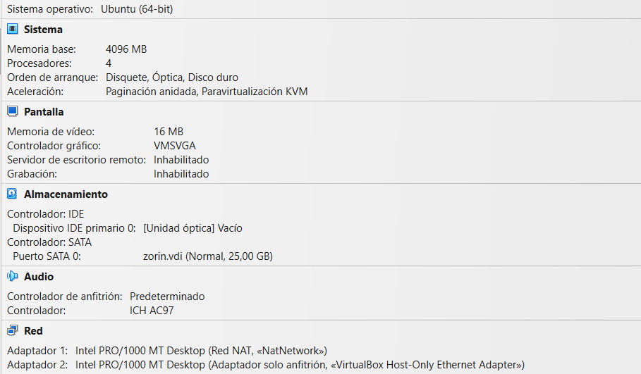

# UD1. Instal·lació Ubuntu Server

Partim de la ISO d'Ubuntu Server que teniu disponible a la xarxa de l'escola. Si voleu descarregar-la a casa, podeu fer-ho des del web oficial d'Ubuntu: [https://ubuntu.com/download/server](https://ubuntu.com/download/server).

Com a hipervisor usarem VirtualBox, que ja teniu instal·lat als equips de classe.

## Requisits de maquinari

Quan s'ha d'instal·lar un sistema operatiu a una màquina física, cal tenir en compte la compatibilitat del hardware, així com els requisits mínims de maquinari. Quan es treballa en entorns virtualitzats, la compatibilitat del hardware és menys rellevant, ja que el hipervisor s'encarrega de simular un entorn de maquinari compatible amb el sistema operatiu convidat, tot i que encara ens hem d'assegurar que el maquinari de l'amfitrió compleixi els requisits mínims per executar el hipervisor i la màquina virtual.

Per exemple, Ubuntu Server 26.04 LTS té versions per a arquitectures de 64 bits (x86_64), ARM com a més populars, però també hi ha versions per arquitectures de servidors i mainframes com IBM Power, IBM System z/ i RISC-V. Això vol dir que si el vostre ordinador és un PC amb processador Intel o AMD de 64 bits, podreu instal·lar la versió x86_64 sense problemes. Si el vostre ordinador és un Mac amb processador Apple Silicon (M1, M2), o un dels servidors ARM com els que s'estan popularitzant a AWS o Azure, haureu d'usar la versió ARM.

A la [pàgina de descàrrega d'Ubuntu Server](https://ubuntu.com/download/server) trobareu els requisits mínims de maquinari per a cada versió i arquitectura.

Per la nostra primera màquina virtual, en crearem un munt al llarg d'aquest curs, us recomanem que configureu la màquina virtual amb els següents requisits:

- **CPU**: 4 nuclis virtuals.
- **RAM**: 4 GB.
- **Emmagatzematge**: 25 GB de disc.
- **Xarxa**:
  - un adaptador en "xarxa NAT" per accedir a Internet i a altres VM dins del mateix host.
  - un segon en mode "host-only" que ens connectar-nos remotament a la màquina virtual des de l'amfitrió (host).

En diverses activitats usarem el model de "xarxa NAT", el qual permetrà crear una xarxa interna al PC aïllada totalment de la resta d’equips i el pont que farà visible la màquina virtual a la xarxa local. Si bé, en alguna ocasió, us demanarem que canvieu el primer adaptador a "xarxa interna" per simular una xarxa aïllada entre màquines virtuals o en adaptador "pont" per fer que la màquina virtual sigui visible a la xarxa local i pugueu accedir-hi des d'altres equips de l'aula.

## Procés d'instal·lació

És important documentar sempre la configuració inicial per tal d'assegurar que la màquina compleix els requisits.

**Recordeu** desmarcar "Proceed with Unattended Installation".

> La "unantetended installation" és una instal·lació automatitzada que no requereix intervenció de l'usuari, ideal per a entorns de producció per automatitzar la tasca i reduir errors humans. 
>
>Tot i que en alguna activitat veurem com usar aquesta funcionalitat, en aquesta primera instal·lació la desactivarem per tal de poder veure tot el procés i entendre què passa a cada pas.

