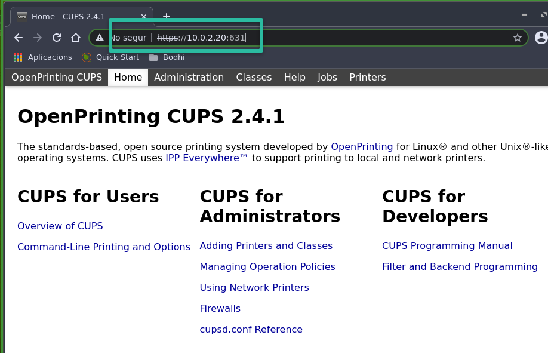
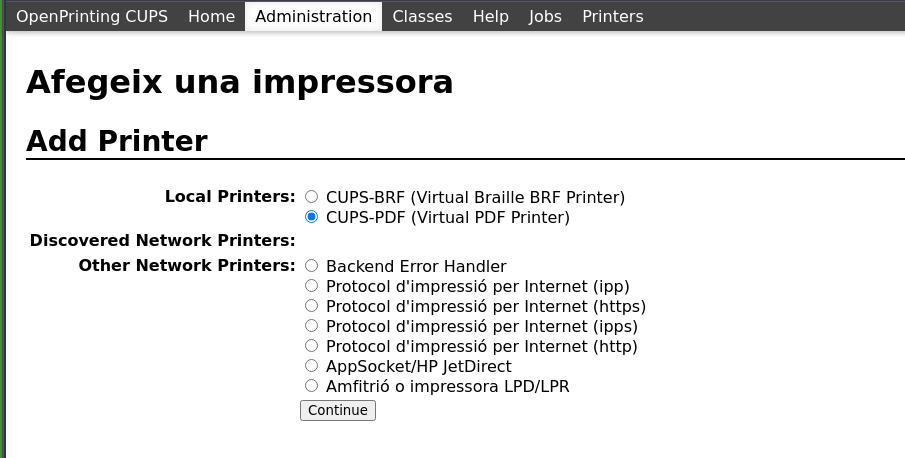
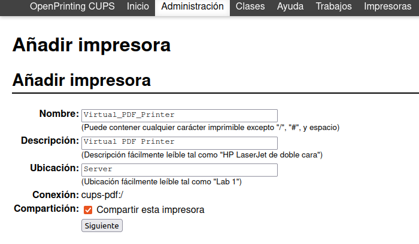
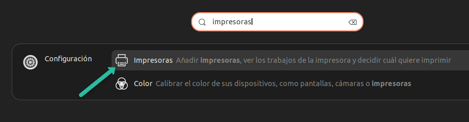
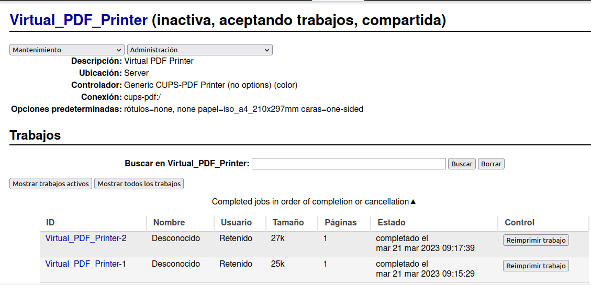

# Compartició impressores (CUPS)

## Protocol CUPS

CUPS (Common Unix Printing System) és un sistema de gestió d'impressores per a sistemes operatius tipus Unix, com Linux i macOS. CUPS utilitza el protocol IPP (Internet Printing Protocol) per gestionar les tasques d'impressió i permet compartir impressores en una xarxa.

El protocol CUPS permet compartir les impressores a la xarxa a través de diversos protocols: Bonjour, LPD (Line Printer Daemon), IPP i HTTP. Això permet que els clients de diferents sistemes operatius puguin accedir a les impressores compartides.

## Instal·lació i configuració de CUPS

Algunes distribucions de Linux ja inclouen CUPS per defecte, però en altres casos cal instal·lar-lo manualment. En el cas d'Ubuntu server cal instal·lar el paquet `cups` i habilitar el servei.

```bash
sudo apt update
sudo apt install cups -y
sudo systemctl enable --now cups
```

Comprova que el servei ha arrencat correctament amb la comanda `sudo systemctl status cups`. Si tot és correcte, hauries de veure un missatge indicant que el servei està actiu i en execució.

El següent pas és editar el fitxer de configuració de CUPS per permetre l'accés remot i compartir impressores. Obre el fitxer `/etc/cups/cupsd.conf` amb un editor de text com `nano` i realitza els canvis següents:

Cercar la línia que mostra les impressores compartides a la xarxa (Browsing Off) i habilitar-la:

```text
Browsing On
```

Per defecte, CUPS només permet l'accés local. Per permetre l'accés remot cal fer el següent canvi:

```text
Listen localhost:631
```

I canviar-lo per:

```text
Port 631
```

De la mateixa manera cal editar la secció `<Location />` i afegir la línia `Allow @LOCAL` per permetre l'accés a tots els clients de la xarxa local:

```text
<Location />
  Order allow,deny
  Allow @LOCAL
</Location>
```

També cal afegir la línia `Allow @LOCAL` a la secció `<Location /admin>` per permetre l'accés a l'administració de CUPS des de la xarxa local:

```text
<Location /admin>
  Order allow,deny
  Allow @LOCAL
</Location>
```

Si es volgués permetre l'accés només des d'un equip en concret, canviaríem el @LOCAL per l'adreça IP de l'equip.

Un cop realitzats els canvis, guardeu el fitxer i reinicieu el servei CUPS per aplicar-los:

```bash
sudo systemctl restart cups
```

Per últim cal donar accés a l'usuari del sistema a l'administració de CUPS:

```bash
sudo usermod -aG lpadmin $USER
```

Comprovem ara des del client (Zorin OS o Ubuntu Desktop) que podem accedir a la interfície web de CUPS del servidor (Ubuntu Server) obrint un navegador i escrivint l'adreça IP del servidor seguida del port 631, per exemple: `http://10.0.2.5:631`. Si tot és correcte, hauries de veure la interfície web de CUPS i podràs afegir impressores compartides.



## Instal·lar i compartir una impressora amb CUPS

Ara ja podem afegir una impressora, en aquest cas una impressora virtual (PDF) que ens permetrà generar documents PDF a partir de qualsevol aplicació que pugui imprimir.





Des del client (Zorin OS o Ubuntu Desktop) podem afegir la impressora compartida des del servidor CUPS. Obrim la configuració d'impressores i busquem la impressora compartida a la xarxa. Un cop trobada, l'afegim i comprovem que podem imprimir correctament.



## Comprovació de la impressora compartida

Des del client llencem diversos documents a imprimir i comprovem que es generen correctament els fitxers PDF a la carpeta de sortida configurada al servidor CUPS.



I al servidor els PDF generats es poden trobar a la carpeta de sortida configurada, `/home/usuari/PDF`.

## Enllaços d'interès

- [Documentació oficial de CUPS](https://www.cups.org/doc/)
- [Ubuntu Server documentation](https://ubuntu.com/server/how-to/networking/cups-print-server)
