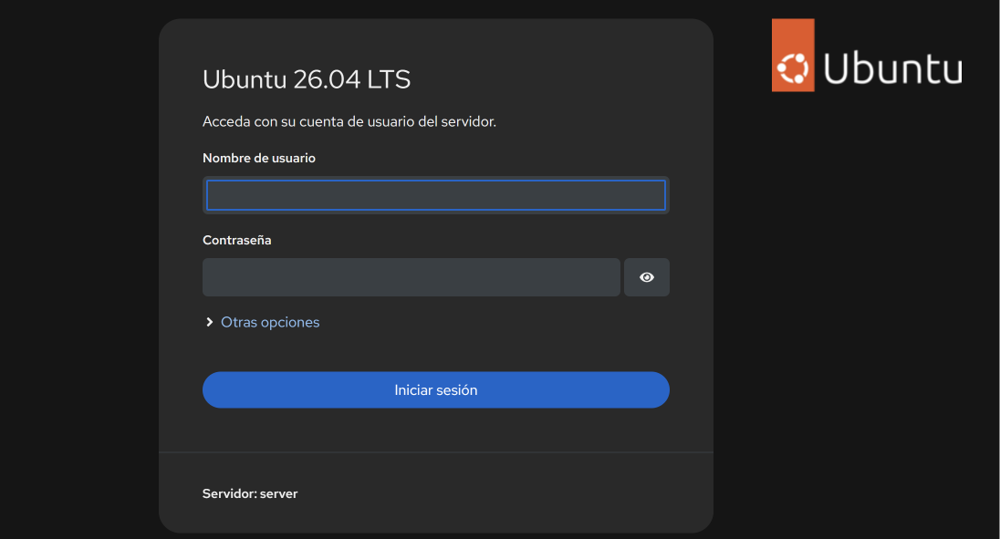
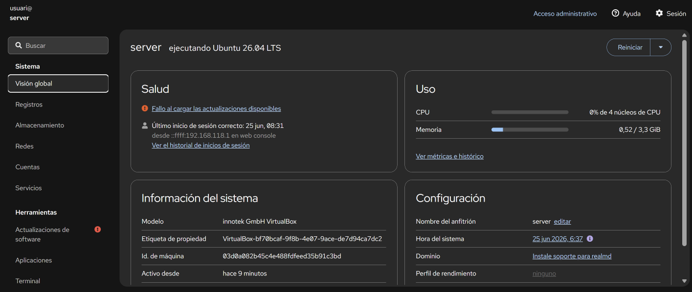
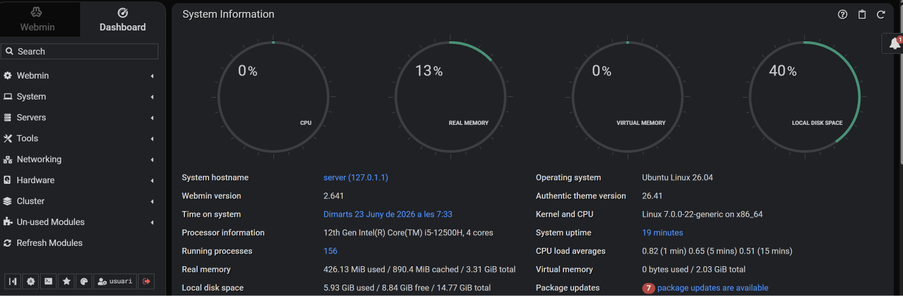
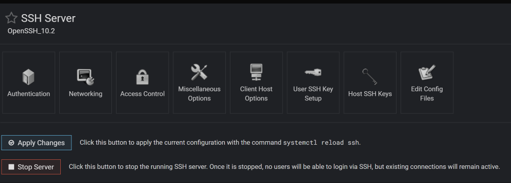
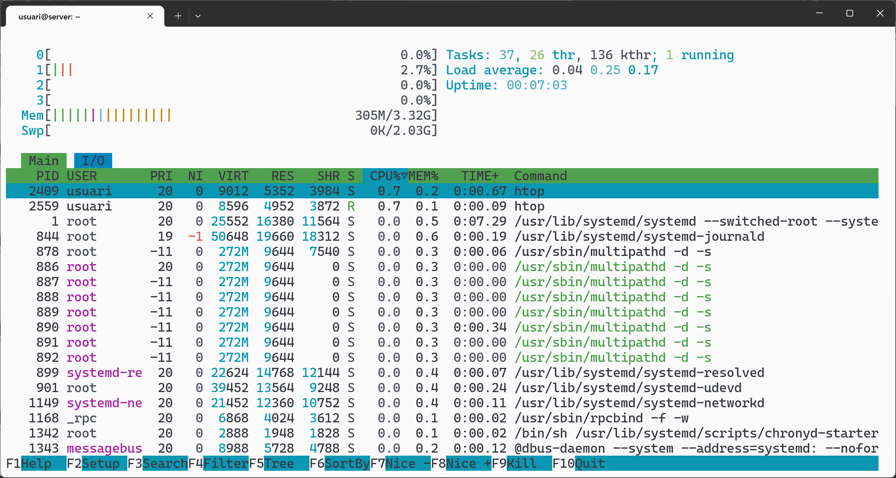
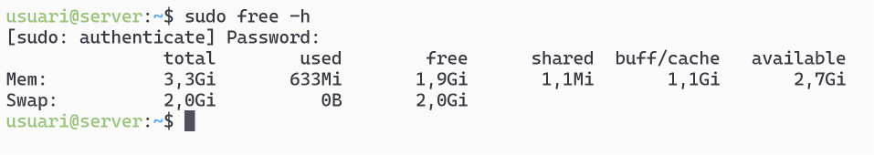
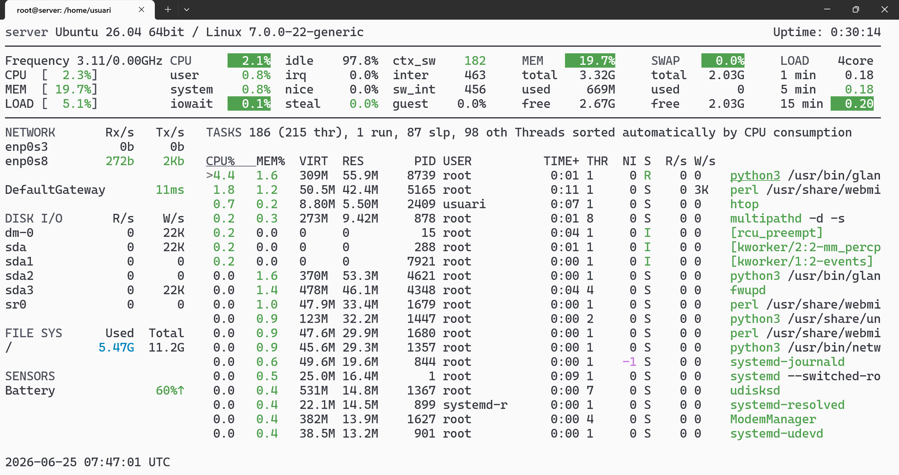
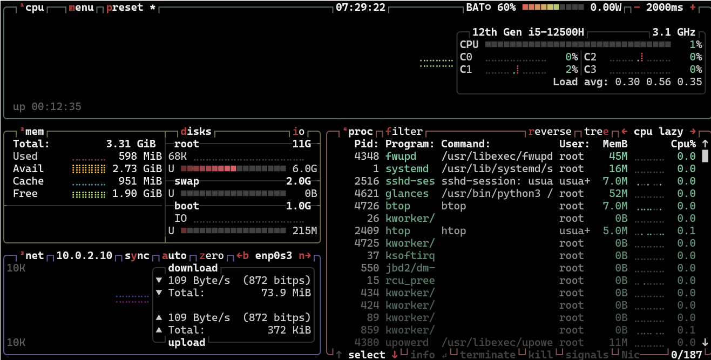

# Administració avançada del servidor Linux

RA 5. Realitza tasques de monitorització i ús del sistema operatiu en xarxa, descrivint les eines utilitzades i identificant-ne les principals incidències

Durada prevista: 8 hores

## Introducció

En un servidor de xarxa local, la instal·lació i els ajustos posteriors no són suficients, s'han de realitzar diferents tasques durant el seu funcionament per garantir que el sistema operatiu i els serveis que ofereix funcionin correctament. Aquestes tasques d'administració del sistema són essencials per mantenir la seguretat, la disponibilitat i el rendiment del servidor.

Per exemple, cal fer un seguiment dels esdeveniments del sistema, comprovar els processos que s'executen en moments concrets, definir quins serveis (o dimonis en terminologia Linux) estan començant pel sistema, gestionar l'execució de dimonis (aturar, reiniciar, llançar) i establir quotes de disc per als usuaris, entre altres tasques.

Aquestes accions es poden realitzar mitjançant la línia d'ordres, però també hi ha eines gràfiques basades en web que faciliten l'administració del sistema i sobretot, ens permeten realitzar aquestes tasques de forma remota, sense necessitat d'accedir físicament al servidor.

> **Nota:** Potser us preguntareu quin sentit té instal·lar eines de gestió gràfiques si podríem haver instal·lat directament un entorn gràfic complet (escriptori) al servidor. La resposta és que habitualment us connectareu de forma remota per gestionar el servidor i per tant, una eina remota web és més eficient que un escriptori remot complet. A més, un entorn gràfic complet consumeix molts recursos del servidor, mentre que una eina web consumeix molts menys.

## Eines gràfiques d'administració de Linux

Necessitat d’administrar servidors de forma remota. S’utilitzen panells web per gestionar la màquina de forma remota.Té l’avantatge que el client només necessita un navegador per connectar-se i administrar i presenta una interfície senzilla.

Més senzill que una connexió de terminal remota (ssh) i sense necessitat de tenir escriptori al servidor (escriptoris remots).Solució típica per la gestió de servidors web, bases de dades, etc.

Poden classificar-se en dues categories:

- **Generals**: Són aplicacions que permeten administrar el servidor Linux, permetent monitoritzar recursos, gestionar els logs i en funció de l'eina administrar els diferents serveis instal·lats. Exemples: Webmin, Cockpit, Ajenti o Plesk. Incorporen fins i tot un terminal per executar les comandes remotament.

- **Específiques**: En aquest cas, parlem d'aplicacions específiques que permeten gestionar un servei concret, com ara un servidor web, un servidor de correu o un servidor de bases de dades. Exemples: phpMyAdmin (per a bases de dades MySQL), Adminer (per a bases de dades SQL), phpLDAPadmin (per a directoris LDAP), Plesk (per a servidors web), etc.

Ara veurem com instal·lar dues eines gràfiques d'administració de Linux: Webmin i Cockpit.

### Instal·lació de Cockpit

[Cockpit](https://cockpit-project.org/) és una eina d'administració de servidors Linux que proporciona una interfície web per gestionar i monitoritzar el sistema. Permet als administradors realitzar tasques com la supervisió del rendiment, la gestió de serveis, la configuració de xarxes, a més de virtualització i contenidors.

Per instal·lar Cockpit a Ubuntu Server,  simplement cal instal·lar el paquet `cockpit`:

```bash
sudo apt update
sudo apt install cockpit
```

Per connectar-nos, obriu un navegador web i accediu a `https://<IP_del_servidor>:9090`. Inicieu sessió amb les credencials d'un usuari del sistema amb drets d'administrador.



Permet veure una visió global de l'estat del sistema: CPU, memòria, etc. També deixa crear usuaris i gestionar serveis, així com veure els logs del sistema. A més inclou un terminal web que permet executar ordres directament al servidor.



### Instal·lació de Webmin

[Webmin](https://www.webmin.com/) és una de les eines d'administració de sistemes basada en web més clàssiques, robustes i completes per a entorns Unix i Linux. T

A diferència d'opcions més modernes i lleugeres com Cockpit, Webmin actua com un autèntic panell de control integral que permet gestionar no només el propi sistema, sinó tota una col·lecció de serveis a través de mòduls configurables.

L'inconvenient és que la seva interfície és menys intuïtiva i més complexa que la de Cockpit, i que és una aplicació força més pesada, amb més dependències i que consumeix més recursos del sistema.

La instal·lació de Webmin a Ubuntu Server és una mica més complexa que la de Cockpit al no usar els repositoris oficials d'Ubuntu. L'opció més senzill és anar a la seva pàgina web i copiar les instruccions d'instal·lació.

```bash
curl -o webmin-setup-repo.sh https://raw.githubusercontent.com/webmin/webmin/master/webmin-setup-repo.sh
sudo sh webmin-setup-repo.sh
sudo apt update
sudo apt install webmin --install-recommends
```

Un cop instal·lat, podeu accedir a Webmin des del navegador web a `https://<IP_del_servidor>:10000`. Inicieu sessió amb les credencials d'un usuari del sistema amb drets d'administrador.


Al panell principal a part de veure l'estat del sistema, podem accedir a diferents mòduls per gestionar serveis, usuaris, grups, paquets, etc. També permet configurar el tallafocs i altres serveis de xarxa.



A Servers podem veure els serveis que tenim instal·lats i el seu estat. Per exemple el de SSH:



A l'opció de 'Un-used modules' podem veure els mòduls disponibles per ser instal·lats, per exemple, el d'Apache o els que ja estan instal·lats però no s'utilitzen perquè el servei no està instal·lat.

### Solucions de gestió de múltiples servidors

Si tenim un conjunt de servidors heterogenis, amb diferents distribucions Linux i versions, pot ser interessant utilitzar una eina de gestió centralitzada que ens permeti administrar tots els servidors des d'una única interfície. Algunes opcions són:

- **Ansible**: És una eina de gestió de configuració i automatització que utilitza un llenguatge de descripció senzill (YAML) per definir les tasques a realitzar i es connecta als servidors mitjançant SSH.
- **Puppet**: És una eina de gestió de configuració que permet definir l'estat desitjat dels servidors i aplicar-lo automàticament. Utilitza un llenguatge de descripció propi i ofereix una interfície web per gestionar els servidors.

## Monitorització del servidor

Monitoritzar el servidor és una tasca essencial per garantir que el sistema operatiu i els serveis funcionin correctament. Hi ha diferents eines que permeten monitoritzar el rendiment del sistema, els processos en execució, l'ús de la memòria i del disc, entre altres aspectes. El primer pas serà conèixer la informació del sistema.

### Recol·lecció informació del sistema

Amb `dmidecode` podem obtenir informació del maquinari del sistema, com ara el fabricant, el model, la versió del BIOS, etc.

Amb les eines `lshw` tenim informació detalla del hardware, que es pot consultar de forma més específica amb:

- `lscpu` per obtenir informació del processador.
- `lsusb` per obtenir informació dels dispositius USB.
- `lspci` per obtenir informació dels dispositius PCI.

Gràficament,des Cockpit o Webmin també podem veure aquesta informació.

### Monitorització del sistema

Quan parlem de monitoritzar el sistema, ens referim a la supervisió del rendiment del servidor, l'ús de recursos i l'estat dels serveis. Alguns paràmetres que podem monitoritzar són:

- **CPU**: Utilització de la CPU, processos en execució, càrrega del sistema.
- **Memòria**: Ús de la memòria RAM, memòria virtual, intercanvi (swap).
- **Disc**: Ús del disc, espai lliure, nombre d'operacions d'entrada/sortida.
- **Xarxa**: Trànsit de xarxa, connexions establertes, errors de xarxa.

#### Monitorització de la CPU

Podem utilitzar la comanda `top` per veure els processos en execució i l'ús de la CPU en temps real, tot i que actualment és més popular usar `htop`(ja ve instal·lat), que ofereix una interfície més amigable i visual. T



Des de les eines gràfiques com Cockpit o Webmin també podem veure l'ús de la CPU i els processos en execució.

### Monitorització de la memòria

Per la monitorització de la memòria podem utilitzar la comanda `free -h`, que mostra l'ús de la memòria RAM i de l'espai d'intercanvi (swap) de manera clara i llegible o `vmstat` que proporciona informació detallada sobre l'ús del sistema encara que d'una manera més confusa.



`htop` i també mostra la informació sobre l'ús de la memòria, així com les eines gràfiques Cockpit i Webmin.

### Monitorització del disc

Tradicionalment, per monitoritzar l'ús del disc s'ha utilitzat la comanda `df -h`, que mostra l'espai utilitzat i disponible en els sistemes de fitxers muntats. També podem utilitzar `du -sh` que és una versió més moderna i clar de llegir la informació. De nou, també des del gestor gràfics tenim aquesta informació de forma visual.

### Monitorització de la xarxa

Per una banda amb `ss` podem veure les connexions establertes i els ports oberts, trànsit d'entrada i sortida, etc. Gràficament, Cockpit i Webmin també ofereixen informació sobre l'estat de la xarxa i les connexions establertes i eines globals com `btop` o `glances` també mostren informació sobre el trànsit de xarxa.

### Altres eines de monitorització

Existeixen moltes altres eines per monitoritzar de forma global com `glances` o `btop` que ofereixen una visió global del sistema:

- `glances`: és una eina de monitorització de sistema que proporciona una visió global del rendiment del servidor escrita en Python i que mostra la informació de forma  molt completa.



- `btop`: és una eina de monitorització de sistema que proporciona una visió global del rendiment del servidor escrita en C++ i que mostra la informació de forma molt completa i amb gràfics.



## Gestió de logs

Ubuntu emmagatzema els regisres dels esdeveniments del sistema en fitxers de text que es troben a `/var/log`. Aquests fitxers contenen informació sobre el funcionament del sistema i dels serveis, així com errors i advertències. La gestió dels logs és essencial per identificar problemes i incidències en el servidor.

Tradicionalment, es consultaven els logs llegint directament els fitxers amb un editor de text o amb comandes com `cat`, `less` o `tail`. Actualment, amb la introducció de `systemd`, els logs es gestionen amb `journald`, que permet consultar els logs amb la comanda `journalctl`.

Aquesta eina permet consultar tots els logs de forma centralitzada i amb filtres com per exemple:

- `journalctl -u <nom_del_servei>`: mostra els logs d'un servei concret.
- `journalctl -f`: mostra els logs en temps real.
- `journalctl --since "2024-01-01"`: mostra els logs des d'una data concreta.
- `journalctl --priority=level`: mostra només els logs per prioritat (level pot ser emerg, alert, crit, err, warning, notice, info, debug).

Des de Webmin o Cockpit també es poden consultar els logs de forma gràfica i amb filtres, sent una de les funcionalitats més útils d'aquestes eines.

Finalment, hi ha eines que permeten gestionar els logs de forma centralitzada i visual, com ara:

- **Logwatch**: és una eina que analitza els fitxers de logs i genera informes resumits dels esdeveniments del sistema i dels serveis. Té una gestió molt potent configurar quins logs s'han d'analitzar i amb quina freqüència, i permet enviar els informes per correu electrònic als administradors del sistema.

```bash
sudo logwatch --range Today --detail Low
```

```shell
 --------------------- SSHD Begin ------------------------ 
 Users logging in through sshd:
    root:
       192.168.1.50: 3 times
 
 Illegal users from:
    203.0.113.5 (unallocated.unknown.IP): 45 times
 ---------------------- SSHD End ------------------------- 

 --------------------- Disk Space Begin ------------------------ 
 /dev/sda1             20G   14G   6.0G  70% /
 ---------------------- Disk Space End ------------------------- 
````

## Enllaços d'interès

- [Pàgina projecte Cockpit](https://cockpit-project.org/)
- [Pàgina projecte Webmin](https://www.webmin.com/)
- [IT-Consulting:Gestión de la Configuración: Ansible, Puppet y Chef para Infraestructura, Servidores y Cloud](https://it-consulting.es/gestion-de-la-configuracion-ansible-puppet-y-chef-para-infraestructura-servidores-y-cloud/)
- [Zenarmor: Linux Server Monitoring, Logs and Tools](https://www.zenarmor.com/docs/linux-tutorials/linux-server-monitoring-logs-and-tools)
- [Linuxconfig.org: Using Logwatch for Basic Security Monitoring on Linux](https://linuxconfig.org/using-logwatch-for-basic-security-monitoring-on-linux)
