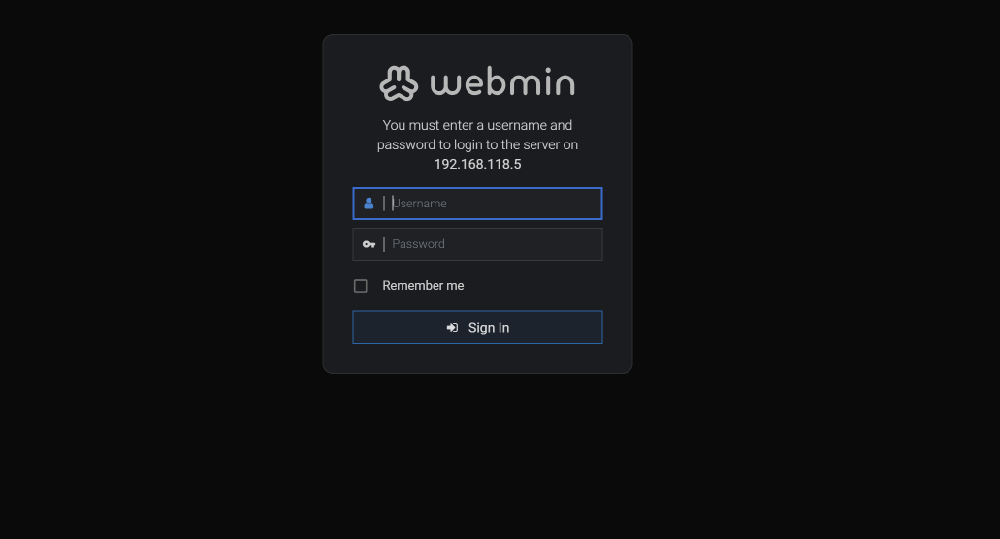

# Administració avançada de Linux

## Introducció

Hem justificat que a un servidor Linux no li cal una interfície gràfica per funcionar correctament. Tot i així, hi ha eines gràfiques que poden ajudar a l'administrador del sistema a monitoritzar i gestionar el servidor de manera més visual i intuïtiva.

Aquestes interfície es basen en aplicacions web que s'executen al servidor i que permeten accedir-hi des d'un navegador, ja sigui des del mateix servidor o des d'un altre ordinador de la xarxa.

## Eines gràfiques d'administració de Linux

Necessitat d’administrar servidors de forma remota. S’utilitzen panells web per gestionar la màquina de forma remota.Té l’avantatge que el client només necessita un navegador per connectar-se i administrar i presenta una interfície senzilla.

Més senzill que una connexió de terminal remota (ssh) i sense necessitat de tenir escriptori al servidor (escriptoris remots).Solució típica per la gestió de servidors web, bases de dades, etc.

Poden classificar-se en dues categories:

- **Generals**: Són aplicacions que permeten administrar qualsevol tipus de servidor Linux, independentment del servei que ofereixi. Exemples: Webmin, Cockpit, Ajenti, etc.
- **Específiques**: Són aplicacions que permeten administrar un tipus concret de servidor, com ara servidors web, bases de dades, etc. Exemples: phpMyAdmin (per a bases de dades MySQL), Plesk (per a servidors web), etc.

### Webmin

Webmin és una de les eines més populars per a l'administració de sistemes Linux a través d'una interfície web. Permet gestionar usuaris, grups, serveis, configuracions de xarxa, i molt més, gràcies a que ofereix una gran varietat de mòduls que cobreixen gairebé tots els aspectes de l'administració del sistema.



#### Instal·lació de Webmin

Webmin no està disponible als repositoris oficials d'Ubuntu, per la qual cosa cal afegir el seu repositori manualment. A continuació es mostren els passos per instal·lar Webmin a Ubuntu Server:

```bash

# Actualitzar el sistema
sudo apt update && sudo apt upgrade -y

# Descarregar l'script de configuració del repositori de Webmin
curl -o webmin-setup-repo.sh https://raw.githubusercontent.com/webmin/webmin/master/webmin-setup-repo.sh

# Executar l'script de configuració
sudo sh webmin-setup-repo.sh
```

L'script automàticament confgigura l'accés al repositori, instal·la la clau GPG i actualitza la llista de paquets. Un cop fet això, podem instal·lar Webmin amb la següent comanda:

```bash
sudo apt install webmin --install-recommends -y
```

Un cop finalitzada la instal·lació, podem accedir a Webmin des del navegador web utilitzant l'adreça `https://<IP_DEL_SERVIDOR>:10000`.


## Monitorització del servidor

## Enllaços d'interès
