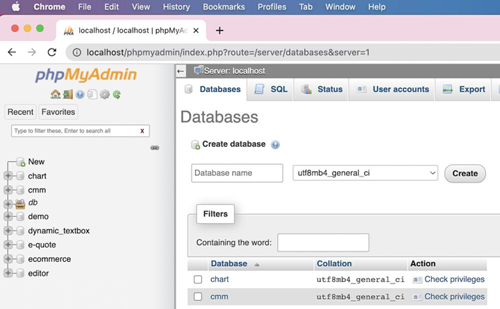
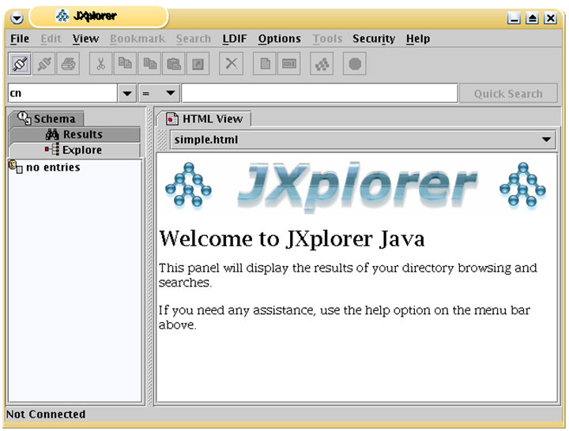

# Administració avançada del servidor Linux

RA 5. Realitza tasques de monitorització i ús del sistema operatiu en xarxa, descrivint les eines utilitzades i identificant-ne les principals incidències

Durada prevista: 8 hores

## Introducció

En un servidor de xarxa local, la instal·lació i els ajustos posteriors no són suficients, s'han de realitzar diferents tasques durant el seu funcionament per garantir que el sistema operatiu i els serveis que ofereix funcionin correctament. Aquestes tasques d'administració del sistema són essencials per mantenir la seguretat, la disponibilitat i el rendiment del servidor.

Per exemple, cal fer un seguiment dels esdeveniments del sistema, comprovar els processos que s'executen en moments concrets, definir quins serveis (o dimonis en terminologia Linux) estan començant pel sistema, gestionar l'execució de dimonis (aturar, reiniciar, llançar) i establir quotes de disc per als usuaris, entre altres tasques.

Aquestes accions es poden realitzar mitjançant la línia d'ordres, però també hi ha eines gràfiques basades en web que faciliten l'administració del sistema i sobretot, ens permeten realitzar aquestes tasques de forma remota, sense necessitat d'accedir físicament al servidor.

> **Nota:** Potser us preguntareu quin sentit té instal·lar eines de gestió gràfiques si podríem haver instal·lat directament un entorn gràfic complet (escriptori) al servidor. La resposta és que habitualment us connectareu de forma remota per gestionar el servidor i per tant, una eina remota web és més eficient que un escriptori remot complet. A més, un entorn gràfic complet consumeix molts recursos del servidor, mentre que una eina web consumeix molts menys.

## Eines gràfiques d'administració de Linux

Necessitat d’administrar servidors de forma remota. S’utilitzen panells web per gestionar la màquina de forma remota.Té l’avantatge que el client només necessita un navegador per connectar-se i administrar i presenta una interfície senzilla.

Més senzill que una connexió de terminal remota (ssh) i sense necessitat de tenir escriptori al servidor (escriptoris remots).Solució típica per la gestió de servidors web, bases de dades, etc.

Poden classificar-se en dues categories:

- **Generals**: Són aplicacions que permeten administrar el servidor Linux, permetent monitoritzar recursos, gestionar els logs i en funció de l'eina administrar els diferents serveis instal·lats. Exemples: Webmin, Cockpit, Ajenti o Plesk. Incorporen fins i tot un terminal per executar les comandes remotament.

- **Específiques**: En aquest cas, parlem d'aplicacions específiques que permeten gestionar un servei concret, com ara un servidor web, un servidor de correu o un servidor de bases de dades. Exemples: phpMyAdmin (per a bases de dades MySQL), Adminer (per a bases de dades SQL), phpLDAPadmin (per a directoris LDAP), Plesk (per a servidors web), etc.

## Monitorització del servidor

## Enllaços d'interès
