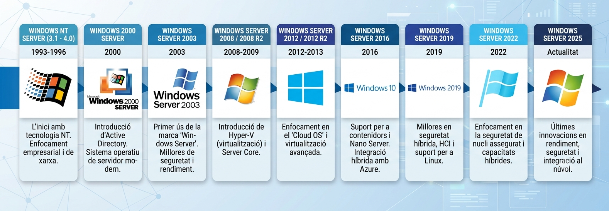
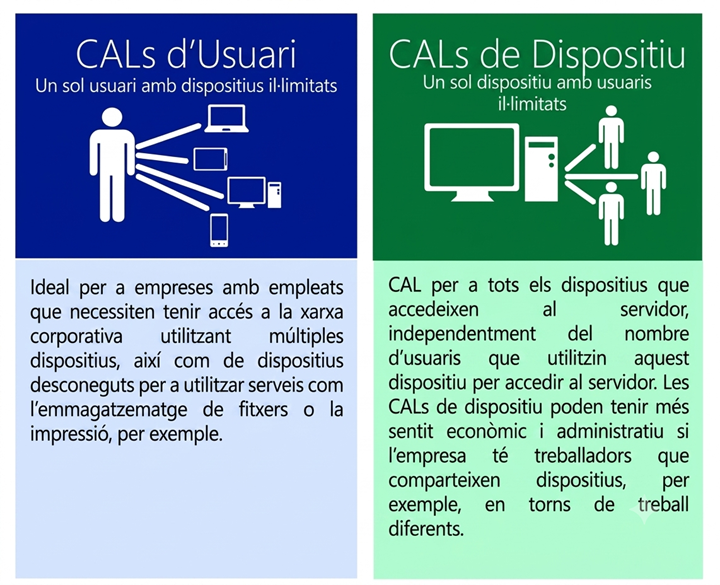

# NF2. Servidors amb Windows Server

En aquest segon nucli formatiu treballarem amb el sistema operatiu Windows Server, explorant la seva instal·lació, la configuració de l'eina que l'ha convertit en un dels sistemes operatius més utilitzats en entorns empresarials, el directori actiu, així com la compartició de recursos.

Durada estimada: 40 hores

## 📚 Índex de continguts

1. [**UD7 - Instal·lació**](./UD7-Instal·lació/README.md)
   - Instal·lació i configuració inicial de sistemes Linux

2. [**UD8 - Directori Actiu**](./UD8-DirectoriActiu/README.md)
   - Configuració del directori actiu

3. [**UD9 - Usuaris i Grups**](./UD9-Usuaris_i_Grups/README.md)
   - Gestió d'usuaris, grups i unitats organitzatives

4. [**UD10 - Administració del Directori Actiu**](./UD10-Gestió_AD/README.md)
   - Administració i gestió del directori actiu: GPO.

5. [**UD11 - Compartició de recursos en Directori Actiu**](./UD11-Recursos/README.md)
   - Configuració i gestió de recursos compartits

6. [**UD12 - Monitorització**](./UD12-Monitoritzacio/README.md)
   - Tècniques de monitorització del sistema

## Introducció a Windows Server

Els inicis de Microsoft en el món dels sistemes operatius es remunten a la dècada de 1980, amb el llançament de MS-DOS, que va ser el sistema operatiu dels primers PC. Posteriorment, va introduir a la seva cartera de productes Xenix, una versió de Unix per arquitectura PC.

L'entrada de l'empresa de Redmond al mercat de servidors es va produir amb el llançament de Windows NT 3.1 el 1993, que va ser el primer sistema operatiu de la família Windows Server.

La família NT es caracteritzava per tenir una versió per servidors i una versió per equips de treball (Windows Workstation). A l'any 2000 es presenta Windows Server 2000, que va introduir el concepte de domini i el **directori actiu**, que permetia gestionar de manera centralitzada els usuaris, grups i recursos d'una xarxa. Fins aquell moment, Microsoft mantenia dues línies de clients: els destinats a grups de treball, Windows 95, 98 i ME, i els destinats a dominis amb, Windows NT Workstation i Windows 2000 Professional. Amb XP va desaparèixer la línia de SO per clients basats en el nucli de MS-DOS i es passa al nucli derivat dels sistemes NT.

Al llarg dels anys, Microsoft ha anat millorant i ampliant les funcionalitats de Windows Server, amb versions com Windows Server 2003, 2008, 2012, 2016 i 2019, etc. fins arribar a la darrera versió Windows Server 2025.

## Característiques Windows Server 2025

Windows Server des de la versió 2008 permet fer dos tipus d'instal·lació: sense entorn gràfic (Server Core) i amb entorn gràfic (Server with Desktop Experience). La versió Server Core és ideal per servidors virtualitzats o remots, ja que es redueix la càrrega de recursos i la superfície d'atac.

Des del punt de vista de versions, Microsoft ofereix Windows Server en dues edicions principals: `Standard` i `Datacenter`. L'edició Standard està pensada per a entorns amb un nombre limitat de màquines virtuals, mentre que l'edició Datacenter és ideal per a entorns amb alta virtualització i núvol privat. Realment, la diferència principal entre ambdues edicions és el nombre de màquines virtuals que es poden executar amb cada llicència.

A més hi ha dues versions més: `Windows Server Essentials`, pensada per a petites empreses i `Windows Server Datacenter Azure Edition`, que està optimitzada per executar-se com màquina virtual al cloud de Microsoft (Azure) o en entorns híbrids.

Les diferents versions tenen limitacions a nivell de serveis, instàncies virtuals que es poden crear i límit d’usuaris.

## Llicenciament

El llicenciament de Windows Server es força diferent del que esteu acostumats per exemple amb Windows 11. Mentre que el model clàssic és necessitar una llicència per cada màquina on s'instal·la el sistema operatiu, a partir de Windows Server 2016 Microsoft va introduir un model de llicències basat en nuclis (cores). Això significa que la llicència es basa en el nombre de nuclis del processador del servidor, i no en el nombre de màquines virtuals o usuaris.

Per llicenciar es fan servir tres regles simultànies:

- Cada servidor físic ha de tenir una llicència per a un mínim de 16 nuclis.
- Cada processador físic ha de tenir una llicència per a un mínim de 8 nuclis.
- Cada nucli addicional per sobre del mínim requerit ha de ser llicenciat (s'ofereixen packs de 2 o 16 nuclis).

Exemples:

- Si tens 1 processador amb 10 cores → Has de comprar 16 cores (pel mínim obligatori per servidor).
- Si tens 2 processadors amb 8 cores cadascun (16 en total) → Has de comprar 16 cores.
- Si tens 2 processadors amb 12 cores cadascun (24 en total) → Has de comprar 24 cores.

A més, la llicència `Standard` permet executar fins a **2 màquines virtuals**, mentre que la llicència `Datacenter` permet un nombre il·limitat de màquines virtuals.

L'excepció és l'edició `Essentials`, que manté el model clàssic de llicència per servidor i permet un màxim de 25 usuaris i 50 dispositius. Habitualment és una llicència que es compra amb el servidor OEM (Original Equipment Manufacturer).

A més, a exepció de l'edició `Essentials`, per connectar-se a un servidor Windows Server, cada usuari o dispositiu que accedeixi al servidor necessita una llicència addicional anomenada **CAL (Client Access License)**. Aquestes llicències poden ser per usuari o per dispositiu, depenent de les necessitats de l'organització.

Així, les CAL d'usuari limiten el nombre d'usuaris que poden accedir al servidor (independentment del número de dispositius), mentre que les CAL de dispositiu limiten el nombre de dispositius que poden connectar-se al servidor.

Diversos fabricants com Lenovo, HP proporcionen calculadores de llicències per ajudar a calcular el llicenciament.

## Enllaços d'interès

- [ITECHTics. Complete List of Windows Server Versions and Timeline](https://www.itechtics.com/windows-server-versions/)
- [Microsoft Learn. ¿Qué es Windows Server](https://learn.microsoft.com/es-es/windows-server/get-started/overview)
- [Microsoft. Precios y licencias de Windows Server](https://www.microsoft.com/es-es/windows-server/pricing)
- [Windows Server 2025 Essentials](https://learn.microsoft.com/en-us/windows-server/get-started/essentials)
- [Lenovo. Licensing Calculator](https://www.lenovosalesportal.com/windows-server-2025-core-licensing-calculator.aspx)
