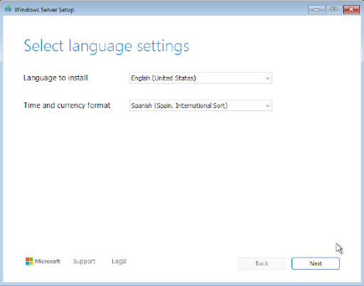
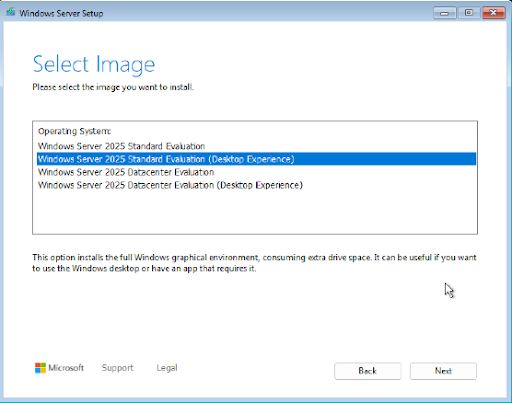
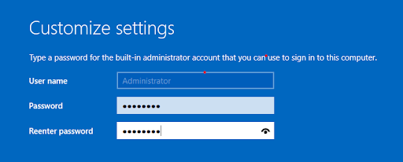
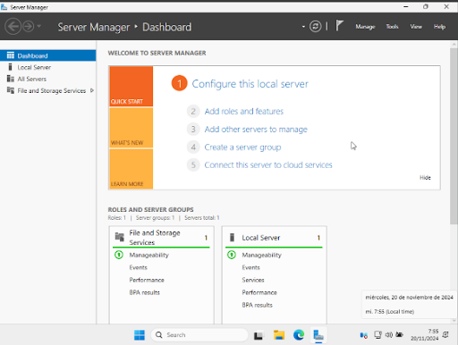

# UD 7. Instal·lació de Windows Server

RA1. Instal·la sistemes operatius en xarxa descrivint-ne les característiques i interpretant-ne la documentació tècnica.

Durada prevista: 2 hores

Partim de la ISO de Windows Server 2025 Evaluation que teniu disponible a la xarxa de l'escola. Si voleu descarregar-la a casa, podeu fer-ho des del web oficial de Microsoft: [https://www.microsoft.com/en-us/evalcenter/evaluate-windows-server-2025](https://www.microsoft.com/en-us/evalcenter/evaluate-windows-server-2025).

Com a hipervisor usarem VirtualBox, que ja teniu instal·lat als equips de classe.

## Requisits de maquinari

La instal·lació de Windows Server 2025 requereix un equip que compleixi uns requisits mínims de maquinari. A continuació es detallen els requisits recomanats per a una instal·lació bàsica.

A la pàgina oficial de Microsoft trobareu informació detallada sobre els requisits de maquinari per a Windows Server 2025. Podeu consultar-los al següent enllaç:

[Requisits mínims de maquinari](https://learn.microsoft.com/es-es/windows-server/get-started/hardware-requirements?tabs=cpu&pivots=windows-server-2025)

## Procés d'instal·lació

A l'igual que a la instal·lació de l'Ubuntu Server, és molt important documentar el procés i la configuració inicial de la màquina virtual. Molt important assegurar-se de mantenir desmarcada la opció "Proceed with Unattended Installation".

La configuració de la màquina virtual serà la següent:

- RAM 8 GB.
- Al processador seleccionar 2 cores.
- Disc de 32 GB.
- Targeta xarxa en mode xarxa NAT.
- Seleccionarem la ISO dins l’opció de la unitat òptica i procedirem a iniciar la màquina.

### Selecció de l'idioma i la distribució del teclat

Instal·lem Windows Server en idioma anglès, però marcant "Time and currency format" com a "Spanish (Spain, International sort)" i "Keyboard or input method" com a "Spanish".

### Tipus d'instal·lació

Ens apareixen les quatre opcions: triarem Standard Edition (Desktop Experience) i farem clic a "Next". Fixeu-vos bé, perquè si trieu la primera opció, s'instal·larà la versió Server Core, que no té entorn gràfic i només es pot administrar per línia de comandes.

A continuació, acceptarem els termes de la llicència i farem clic a "Next".

### Configuració del compte d'administrador

El primer usuari que es crea al sistema, és l'usuari administrador (Administrator) en aquest pas, s'ha de posar la contrasenya. Haureu de posar obligatòriament com a contrasenya "P@ssw0rd" (sense les cometes).

Un cop acabat el procés d'instal·lació, el sistema es reiniciarà automàticament i ens demanarà la contrasenya de l'usuari administrador que hem creat anteriorment. Un cop introduïda la contrasenya, ja podrem accedir a l'escriptori de Windows Server 2025.

