# UD 8. Desplegament de un Directori Actiu

RA3. Realitza tasques de gestió sobre dominis identificant necessitats i aplicant eines d'administració de dominis.

Durada prevista: 4 hores

## Concepte de directori actiu

El directorio actiu és el producte estrella de Microsoft per a la gestió de dominis i xarxes. Aquesta tecnologia es va presentar amb Windows 2000 Server i a partir de Windows Server 2003 es va convertir en un el nucli de les xarxes locals de moltes organitzacions.

És un **servei de directori** que permet administrar i organitzar recursos dins d'una xarxa, com ara usuaris, grups, ordinadors i altres dispositius. Funciona com una guia telefònica digital que permet als administradors controlar l'accés i els permisos de manera ràpida i segura.

Un servei de directori, es una base de dades que emmagatzema informació sobre els recursos d'una xarxa i proporciona serveis d'autenticació i autorització per a aquests recursos.

El directori actiu utilitza protocols com LDAP (Lightweight Directory Access Protocol) per a la consulta i modificació de la informació del directori, DNS (Domain Name System) per a la resolució de noms i Kerberos per a l'autenticació segura.

### Objectius del directori actiu

- Administració centralitzada:
  - Usuaris, equips i grups s’administren des d’una estructura comuna.
  - Polítiques basades en els grups (GPO) que permeten configurar els sistemes de forma centralitzada.
- Seguretat:
  - Els usuaris s’autentiquen contra el sistema per assegurar la seva identitat, enlloc de tenir que autenticar-se en cada equip de forma local.
  - Els equips accedeixen als serveis mitjançant auntenticació usant el protocol Kerberos.

### El controlador de domini

La gestió del directori actiu la realitzen els controladors de domini (DC).
En Windows 2025 es poden tenir tants DC com es vulguin gestionant un domini.

Els DCs del domini s’aniran replicant la informació entre ells i repartint-se els roles. Des de 2008 Server, la gestió del domini es realitza mitjançant DNS, per això cal que existeixi sempre un servidor DNS que contingui el domini.

### Relacions de confiança entre dominis

Una característica dels dominis de directori actiu és l’opció d’establir relacions de confiança entre dominis, cosa que permet la interoperabilitat entre dominis diferents. Aquesta característica és especialment útil en entorns empresarials on hi ha múltiples dominis que necessiten compartir recursos i informació.

La confiança (trust) és un vincle lògic entre dos dominis que permet que els usuaris d'un domini accedeixin als recursos de l'altre (com carpetes o impressores) sense haver de crear un compte nou.

Confiança pot ser unidireccional o bidireccional i es pot establir transitivitat (A->B B->C aleshores A->C).

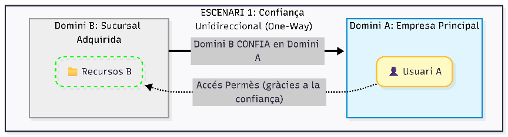

## Creació d’un domini amb directori actiu

L'element central de l'administració d'un equip Windows Server amb entorn gràfic és el "Server Manager", que permet gestionar els rols i característiques del servidor, així com supervisar el seu rendiment i estat. Des d'allà es tenen accés a totes les eines d'administració del sistema, incloent-hi la instal·lació de rols i característiques, les consoles d'administració, les configuracions de l'equip, la gestió d'errors o incidències, etc.

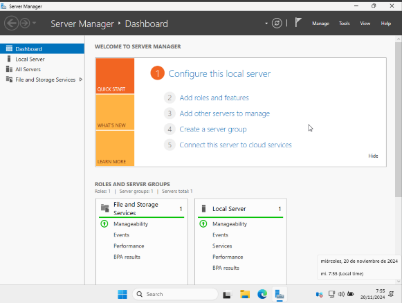

### Configuracions incials

El primer pas serà canviar el nom del servidor, per un nom és identicatiu, com per exemple "DC1". Per canviar el nom del servidor, anirem a "Local Server" i farem clic a "Computer Name".

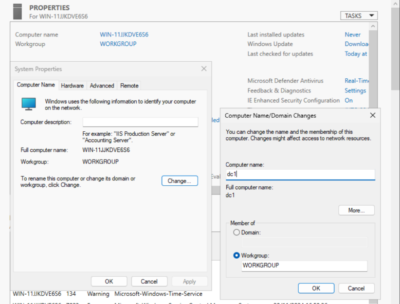

El següent pas és canviar la configuració de xarxa per tal que el controlador del domini s'apunti a sí mateix com a servidor DNS. Aquest pas és molt important, ja que si no el propi controlador de domini no veurà el domini. Per tant, anirem a la configuració de xarxa, bé des de "Local Server" o bé des directament des de la iconeta de xarxa a la barra de tasques, i configurarem l'adreça del servidor DNS com localhost (127.0.0.1).

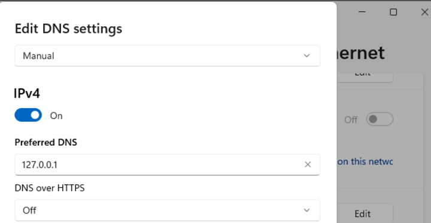

Un aspecte important és configurar correctament la zona horària. En ser una versió USA, la zona horària per defecte és "Pacific Time (US & Canada)", que no és la correcta per a Espanya. Per tant, cal canviar-la a "Romance Standard Time" (Madrid, Barcelona, París, Roma).

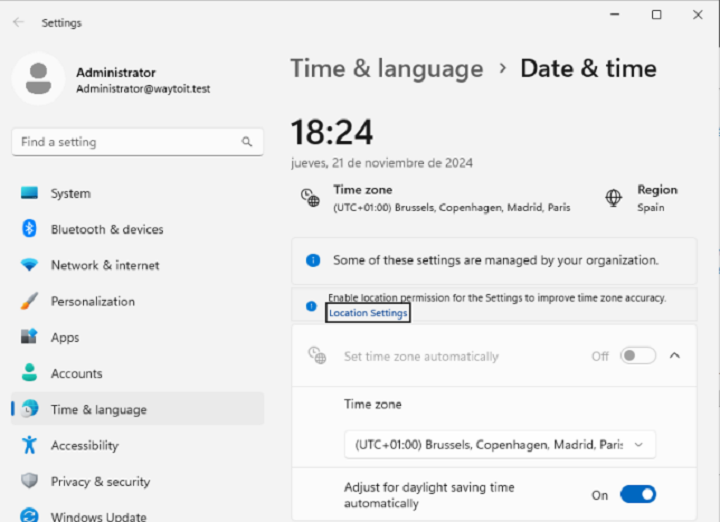

### Instal·lació rol de "Active Directory Domain Services"

Ara ja podem procedir a la instal·lació del rol de "Active Directory Domain Services" (AD DS). Per fer-ho, anirem a "Manage" i farem clic a "Add Roles and Features".
  
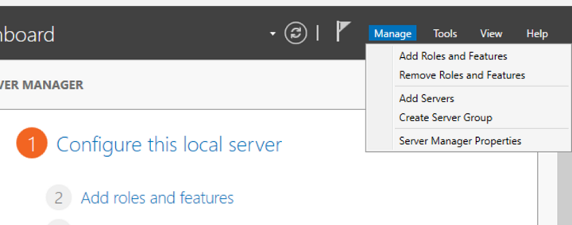

Indiquem que volem fer una instal·lació basada en rols i característiques, seleccionarem el servidor on volem instal·lar el rol i farem clic a "Next".

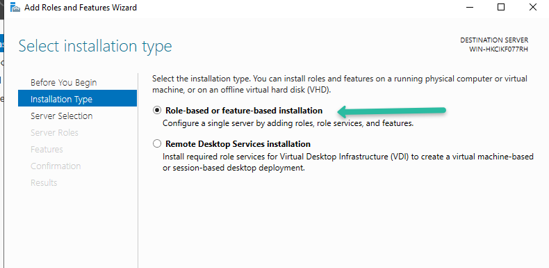

Una característica de Server Manager és que ens permet instal·lar rols i característiques en un altre servidor de la xarxa. Per tant, demana que indiquem el servidor on volem instal·lar el rol, en aquest cas serà el mateix servidor on estem treballant.

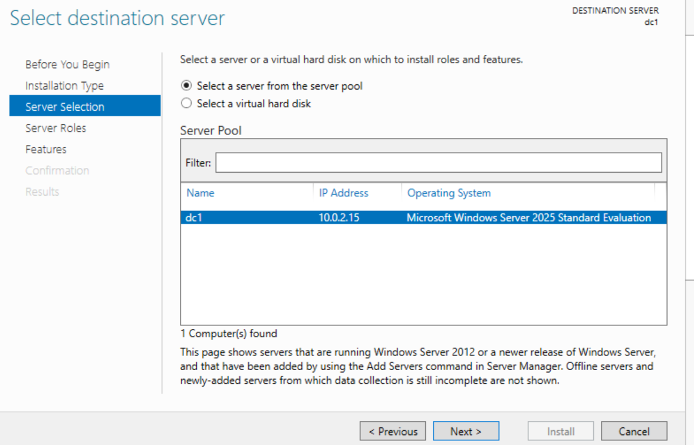

 S'obrirà l'assistent d'instal·lació de rols i característiques, on seleccionarem el rol de **"Active Directory Domain Services"** i seguirem les instruccions per completar la instal·lació.

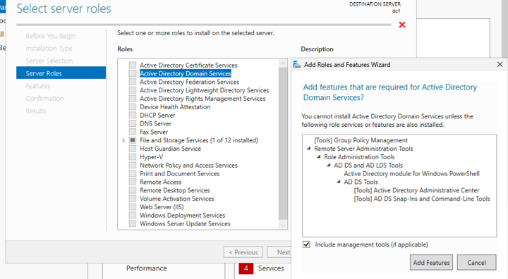

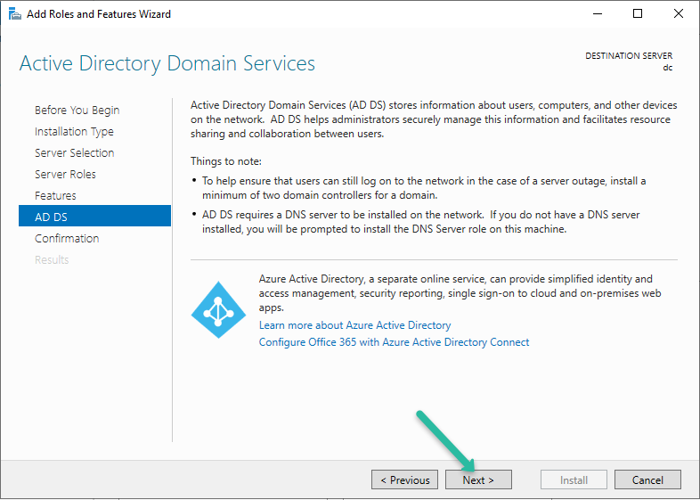

El sistema marca per defecte els característiques (features) associades al rol que es vol instal·lar, com ara el servei DNS i altres eines d'administració. Acceptarem les opcions per defecte i farem clic a "Next" fins arribar a la pantalla de resum, on farem clic a "Install" per iniciar la instal·lació del rol.

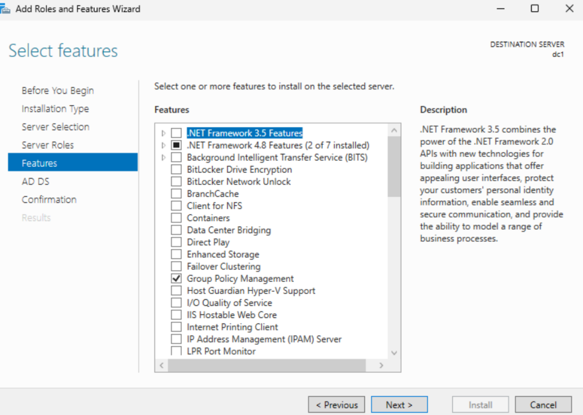

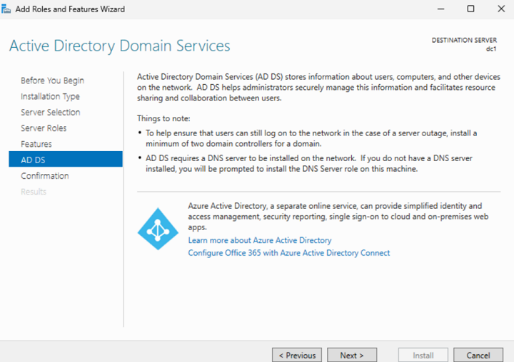

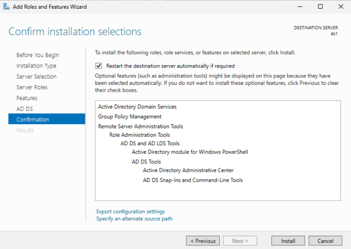

### Promoció del servidor a controlador de domini

Un cop instal·lat el rol, cal fer el desplegament, se'ns marcarà una notificació a la part superior del "Server Manager" indicant que cal fer el desplegament del rol. Farem clic a "Promote this server to a domain controller".

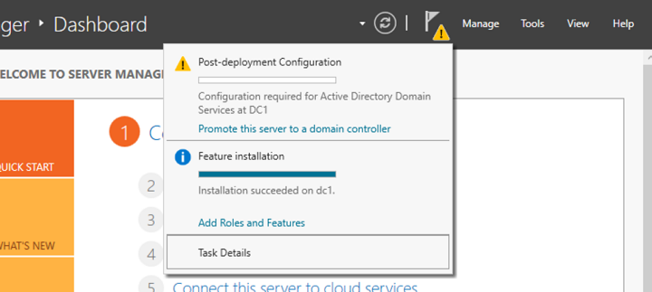

A continuació cal seleccionar el tipus de desplegament, les opcions són:

- **Afegir un controlador de domini a un domini existent**: és afegir un nou controlador de domini a un domini que ja existeix.
- **Crear un nou arbre de dominis dins d’un bosc existent**: és crear un subdomini dins d’un domini que ja existeix. Per exemple, si el domini existent és "waytoit.test", es podria crear un subdomini "mataro.waytoit.test".
- **Crear un nou domini**: és crear un nou domini, dins d’un nou bosc (forest) i posar-li un nom, com per exemple "waytoit.test".

En el nostre cas, com que és el primer controlador de domini que crearem, seleccionarem l'opció de crear un nou domini dins d’un nou bosc.

> La diferència entre un domini i un bosc és que un domini és una unitat administrativa dins d'una xarxa, mentre que un bosc és una col·lecció de dominis que comparteixen un esquema comú i una estructura jeràrquica. En altres paraules, un bosc és un conjunt de dominis relacionats entre si.

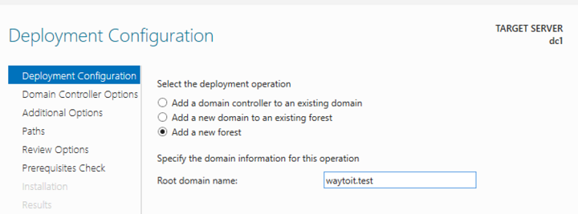

Ara cal indicar el nivell funcional del bosc i del domini, que marca la compatibilitat del domini amb els istemes operatius, en aquest cas serà Windows Server 2025.

També cal indicar la contrasenya de restauració dels serveis d’Active Directory (DSRM), per evitar oblits, posarem la mateixa contrasenya que la de l’usuari administrador.

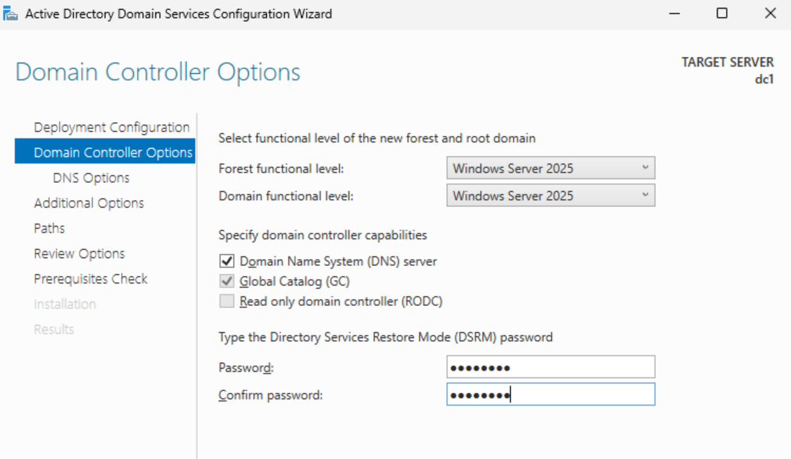

Ja hem indicat anteriorment que el servei de directori actiu utilitza DNS, el sistema avisa que no troba cap disponible i que procedeix a instal·lar-lo. Acceptarem la instal·lació del servei DNS.

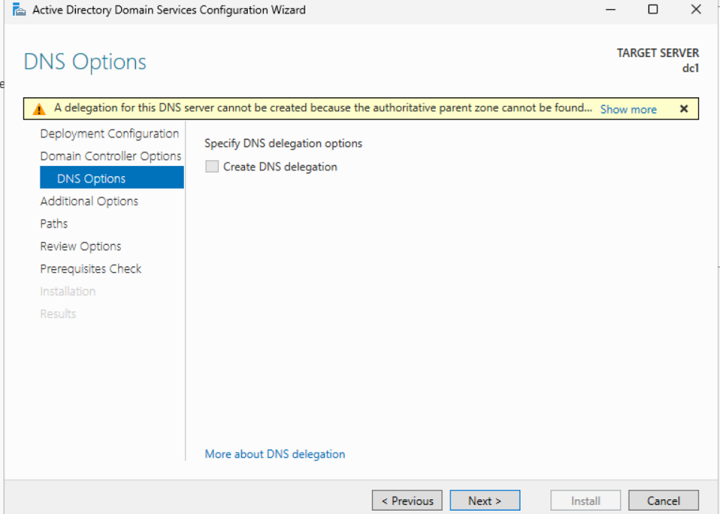

Abans d'usar els serveis DNS, els servidors Windows usaven un protocol propi anomentat NETBIOS i que encara avui es fa servir per a la resolució de noms en xarxes locals. Per això, cal indicar un nom NETBIOS pel domini, que serà el mateix que el nom del domini, però sense els sufixe i en majúscules.

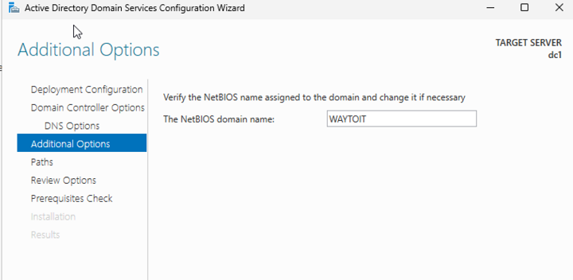

Ens demana on ubicarà els arxius de gestió del directori actiu, deixarem les opcions per defecte i farem clic a "Next", per arribar a la pantalla de resum, on farem clic a "Install" per iniciar el procés de promoció del servidor a controlador de domini.

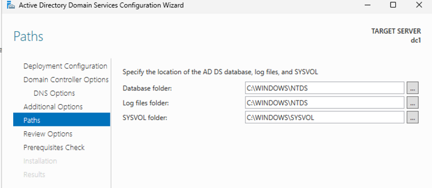

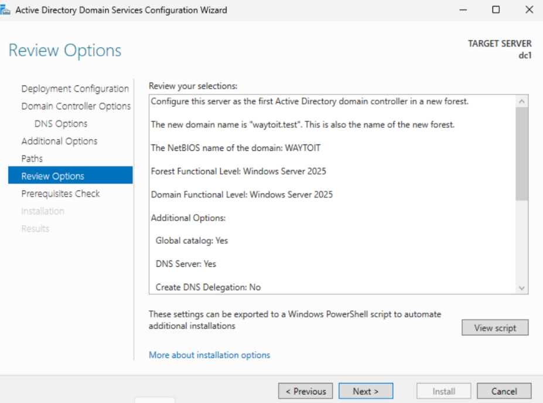

A més, genera un script de PowerShell amb les ordres que s’han executat, per si volem fer la promoció del servidor a controlador de domini mitjançant línia de comandes. Això és ideal a l'hora de fer promocions massives de servidors, ja que es poden automatitzar amb scripts.

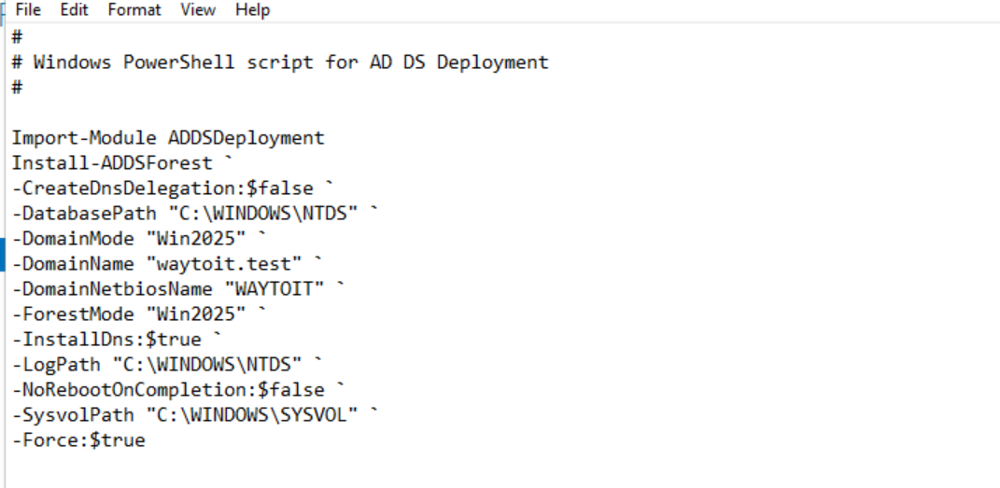

Fa una comprovació de tots els requisits i si tot és correcte, inicia el procés de promoció del servidor a controlador de domini. Un cop finalitzat, cal reiniciar el servidor per aplicar els canvis.

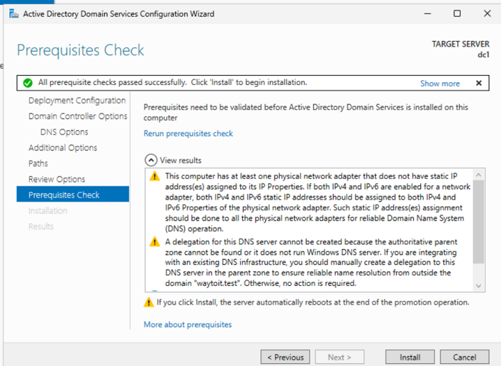

Un cop acaba la instal·lació, el sistema ens demana reiniciar el servidor per aplicar els canvis. Farem clic a "Close" i després a "Restart Now" per reiniciar el servidor.

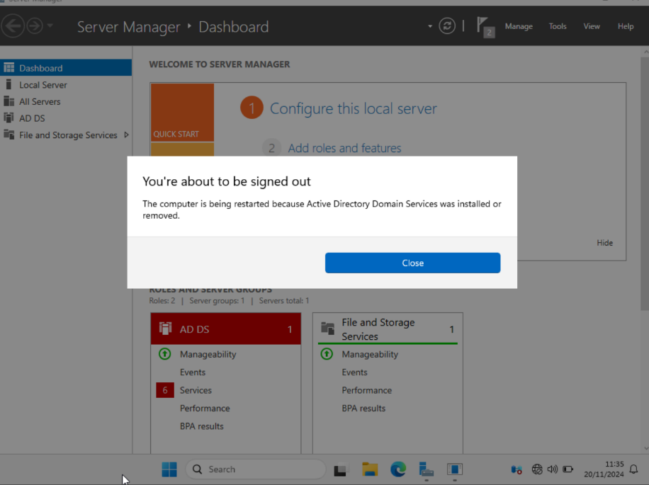

Ara a l'iniciar el servidor, ja no ens demana la contrasenya de l'usuari local, sinó que ens demana la contrasenya de l'usuari administrador del domini. Per tant, caldrà indicar el nom del domini i després la contrasenya de l'usuari administrador.

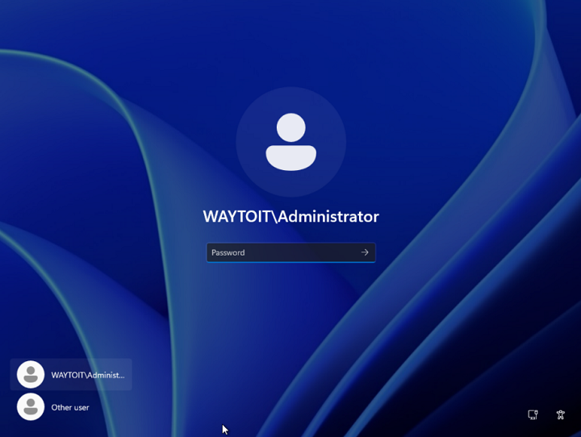

### Configuracions post desplegament

Hem configurat el controlador de domini amb el DNS apuntant-se a sí mateix. Això vol dir que actua com un servidor de noms i per tant, a l'hora de resoldre noms de Internet faria consultes iteratives (ho veureu amb més detall al mòdul de Serveis de Xarxa).

El problema, és que aquest tipus de consultes iteratives, no són gaire eficients i poden provocar retards a l'hora de resoldre noms. Per aquest motiu, és recomanable configurar un reenviador DNS extern perquè s'encarregui de les consultes a Internet.

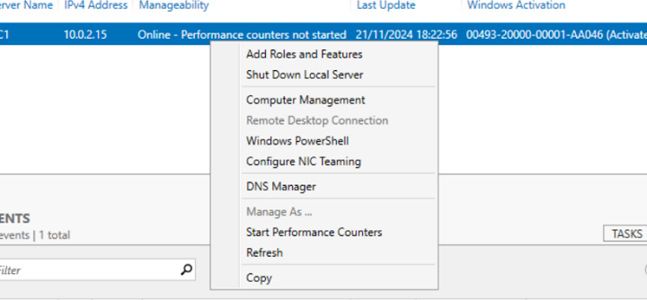

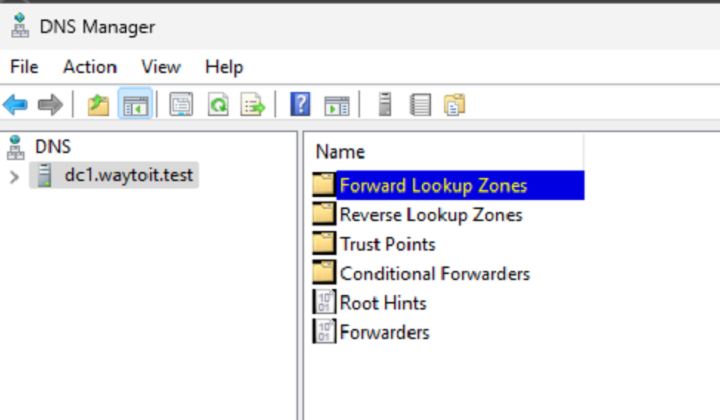

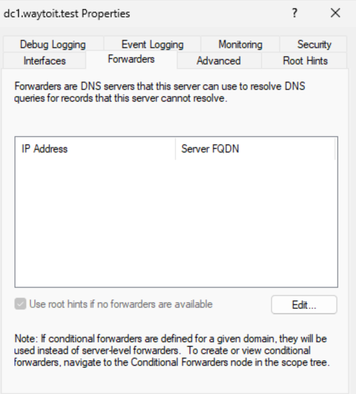

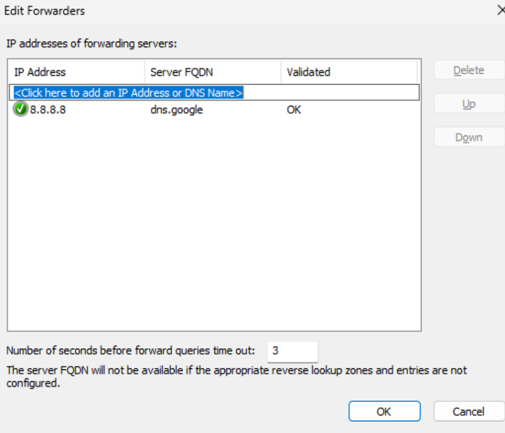

Ja tenim el nostre domini creat i el servidor promocionat a controlador de domini. Ara ja podem començar administrar-lo i la pregunta és, quines eines tenim disponibles per fer-ho?

Doncs bé, Microsoft ens ofereix una sèrie d'eines gràfiques i de línia de comandes per administrar el directori actiu:

- Server Manager: és l'eina principal d'administració del servidor, des d'on es poden gestionar els rols i característiques del servidor, incloent-hi el directori actiu.

- Windows Admin Center: és una eina web que permet administrar servidors Windows de manera remota, incloent-hi el directori actiu. No ve instal·lat per defecte, però es pot descarregar i instal·lar fàcilment. Encara no té totes les funcionalitats del Server Manager, però és una eina molt útil per a l'administració remota.

- PowerShell: és una eina de línia de comandes que permet administrar el directori actiu mitjançant cmdlets específics. És molt potent i permet automatitzar tasques d'administració. Recordeu que hi ha la possibilitat d'instal·lar el Server sense entorn gràfic, en aquests casos, PowerShell és l'única eina disponible per administrar el directori actiu.

Ja podem apagar el nostre servidor, quan ho feu, al seleccionar "Shut down" us demanarà el motiu de l'apagat, us pot semblar estrany, però un servidor és una peça fonamental del sistema i cal tenir un registre de les accions que es fan sobre ell. Per tant, cal indicar el motiu de l'apagat, com per exemple "Manteniment".

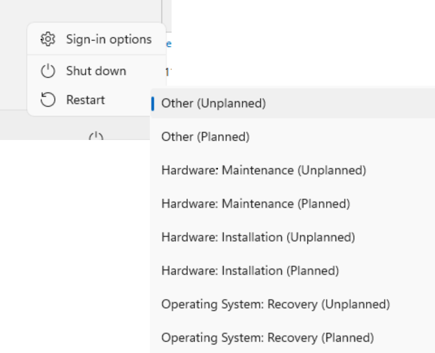
