# UD9. Gestió d'usuaris i grups

RA2. Gestiona usuaris i grups de sistemes operatius en xarxa, interpretant especificacions i aplicant eines del sistema.

Durada prevista: 8 hores

## Introducció

Ara que ja tenim instal·lat el nostre directori actiu, és hora de començar a gestionar els usuaris i grups del sistema. En aquest apartat aprendrem a crear, modificar i eliminar usuaris i grups, així com a assignar permisos i rols adequats.

Prèviament, veurem un element bàsic de l'administració de serveis de directori: la unitat organitzativa (OU). Les unitats organitzatives ens permeten organitzar els nostres usuaris i grups de manera jeràrquica, facilitant la gestió i aplicació de polítiques.

## Unitats organitzatives (OU)

És un tipus especial d'objecte dins un directori. Són contenidors on ubicar la resta d'objectes del directori, com ara usuaris, grups, equips i altres unitats organitzatives. Les unitats organitzatives ens permeten organitzar els nostres usuaris i grups de manera jeràrquica, facilitant la gestió i aplicació de polítiques. Només poden contenir objectes del mateix domini.

I quina és la seva utilitat?

- En primer lloc, ens permeten organitzar els nostres usuaris i grups de manera jeràrquica, facilitant la gestió i aplicació de polítiques.
- Permeten aplicar polítiques de grup (GPO) a un conjunt d'usuaris o equips dins d'una unitat organitzativa específica.
- Faciliten la delegació de permisos d'administració a usuaris específics, permetent que només tinguin accés a gestionar els objectes dins d'aquesta unitat organitzativa.

Per tant, el primer pas abans de crear cap altre objecte és definir la nostra estructura d'unitats organitzatives. Això definirà l'estructura del domini.

### Estratègies d'organització

En general es recomana que l'estrctura del domini sigui un mirall de l'estructura de l'organització. Així podem pensar en diversos models:

- **model geogràfic**: si l'organització té diverses seus, podem crear una unitat organitzativa per a cada seu.

- **model departamental**: si l'organització té diversos departaments, podem crear una unitat organitzativa per a cada departament.

- **model mixt**: podem combinar els models anteriors, creant unitats organitzatives per a cada seu i dins de cada seu, unitats organitzatives per a cada departament.

Cal evitar en qualsevol cas crear unitats organitzatives innecessàries, ja que això pot complicar la gestió del directori.

A part d'aquest model hi ha una sèrie de bones pràctiques a aplicar:

- Separar usuaris i equips en unitats organitzatives diferents.
- Evitar usar els contenidors per defecte (com ara "Users" i "Computers") per ubicar els nostres objectes, ja que no permeten aplicar polítiques de grup ni delegar permisos d'administració.

Un exemple d'estructura jeràrquica d'unitats organitzatives podria ser el següent:

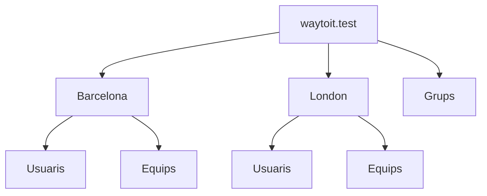

Com els grups seran comuns entre les dues seus, els ubiquem a una unitat organitzativa separada. D'aquesta manera, podrem assignar permisos a grups d'usuaris de les dues seus sense haver de duplicar els grups.

## Gestió Users and Computers

És la consola que permet gestionar els objectes del directori actiu. Des d'aquesta consola podrem crear, modificar i eliminar unitats organitzatives, usuaris i grups.

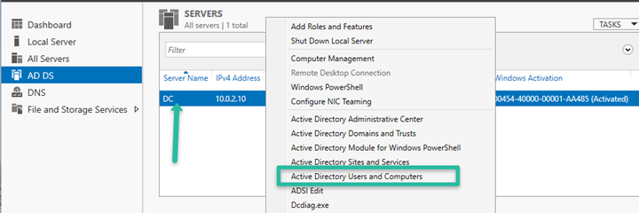

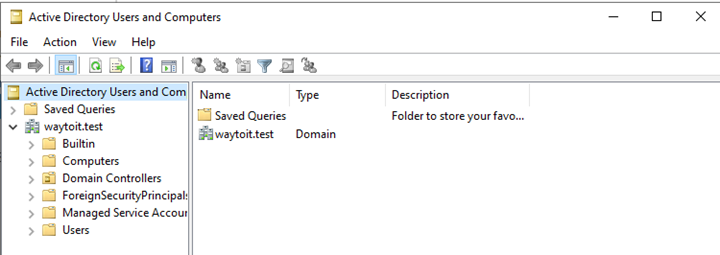

## Creació d'unitats organitzatives (OU)

Quan es crea una unitat organitzativa, per defecte ve amb el check de "Protegir objectes d'aquesta unitat organitzativa de l'eliminació accidental" activat. Això vol dir que no podrem eliminar o moure la unitat organitzativa fent directament suprimir.

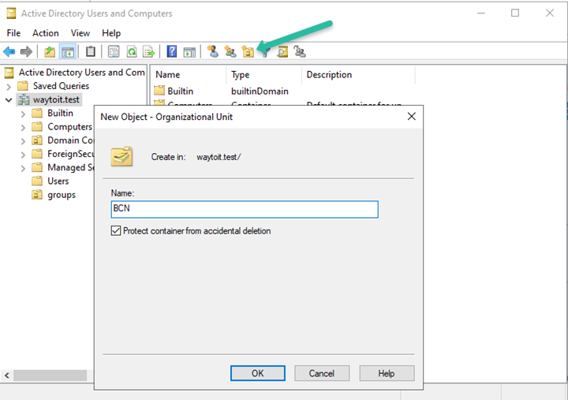

Si necessiteu eliminar una unitat organitzativa, haureu de desactivar aquesta opció. Per fer-ho, feu clic amb el botó dret sobre la unitat organitzativa i seleccioneu "Propietats". A continuació, desmarqueu l'opció "Protegir objectes d'aquesta unitat organitzativa de l'eliminació accidental".

## Grups

Els grups són objectes del directori que permeten agrupar usuaris, equips (no solen ser tant habituals) i altres grups. Els grups ens permeten assignar permisos i rols a un conjunt d'usuaris de manera més eficient.

Un concepte important a tenir en compte és que no són contenidors, és a dir, els objectes no estan "dins el grup", sinó que far referència a una pertinença. Una forma fàcil d'entendre-ho és pensar que podeu ser membres d'un club de futbol, d'un gimnàs i d'un grup de música alhora. No esteu "dins" d'aquests grups, sinó que en formeu part.

### Tipus de grups

Els grups a Active Directory es poden classificar segons dos criteris: l'àmbit i el tipus.

- **Grups de distribució**: són grups que s'utilitzen per enviar correus electrònics a un conjunt d'usuaris. No tenen permisos d'accés a recursos i per tant, no els usarem en aquest curs.

- **Grups de seguretat**: són grups que s'utilitzen per assignar permisos d'accés a recursos del sistema. Aquests són els grups que utilitzarem en aquest curs. Els grups de seguretat es classiquen pel seu àmbit (scope):

  - **Àmbit global**: els membres han de ser del mateix domini. Pot accedir a recursos locals o remots.

  - **Àmbit local**: els membres poden ser locals o remots, però només pot accedir a recursos locals.

  - **Àmbit universal**: poden contenir usuaris i grups de qualsevol domini del bosc. Poden assignar permisos a recursos de qualsevol domini del bosc.

### Estratègia de creació de grups

En dominis grans o en entorns amb diversos dominis, és recomanable utilitzar grups globals per agrupar usuaris i grups locals per definir permisos d'accés a recursos. Els grups locals tenen com a membres els diferents grups globals.

En un entorn petit, es pot simplificar i usar únicament grups globals, ja que no hi ha tants usuaris ni recursos.

### Creació d'un grup global

Crearem el grup sobre la unitat organitzativa "Grups" que hem creat anteriorment. Per fer-ho, feu clic amb el botó dret sobre la unitat organitzativa i seleccioneu "Nou" -> "Grup".

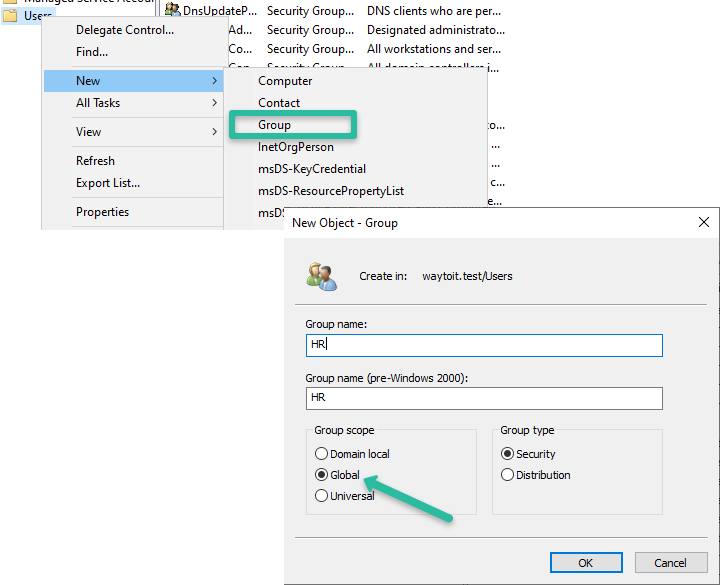

A Propietas del grup podem definir els "Members" del grup, és a dir, els usuaris i grups que en formaran part. També podem definir els "Member of", és a dir, els grups als quals aquest grup pertany.

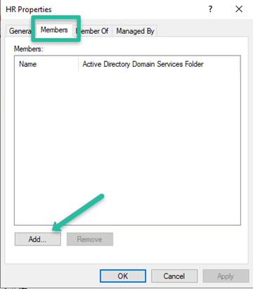

A un grup afegirem normalment usuaris, però també es poden afegir grups. Per exemple, es pot definir un GSINF que inclogui dos grups, DAM i DAW, així tot els membres de DAM i tots els membres de DAW són membres del grup GSINF.

Per l'exemple que anirem desenvolupant al llarg de la unitat, crearem dos grups globals: "HR" i "tecnics".

## Usuaris

Els usuaris són comptes individuals que permeten accedir al directori actiu (validar-se en un dels equips clients).

Per crear els usuaris tenim diversos mètodes:

- **Manual**: es crea cada usuari i se li assignen pertinences i propietats.
- **Plantilles**: es crea un usuari amb les propietats que volem i després es poden crear nous usuaris a partir d'aquest usuari plantilla.
- **Importació massiva**: es poden importar usuaris des d'un fitxer CSV amb les dades dels usuaris.

### Tips per crear usuaris

- Evitar crear usuaris amb noms genèrics com "usuari1", "usuari2", etc. És millor utilitzar un nom que identifiqui a l'usuari, com ara el seu nom i cognoms. Això facilita que si un usuari canvia de rol dins l'organització, es pugui canviar el seu nom d'usuari sense haver de crear un nou usuari.

- Evitar amb la mida del possible accents i caràcters especials en els noms d'usuari, ja que poden causar problemes amb alguns programes i scripts.

Exemples de noms d'usuari: joan.abella, maria.garcia, carlos.lopez, etc. En general, es recomana utilitzar el format nom.cognom, ja que és fàcil d'entendre i recordar.

### Carpetes personals i perfils d'usuari

En un entorn de directori actiu, cada usuari sol tenir una carpeta d'accés personal a la xarxa (de manera similar a com ho teniu a la intranet de l'escola).

A més, cada usuari té un perfil, aquest perfil es crea a nivell local en cada equip on es valida. A Windows 11, el perfil de l'usuari es copia a partir del perfil per defecte de l'equip, que es troba a la carpeta C:\Users\Default.

En entorns de directori, és possible configurar el que s'anomenen perfils mòbils, que permeten que l'usuari tingui el mateix perfil en qualsevol equip del domini, ja que es copia el perfil de l'usuari a un directori compartit de la xarxa.

En tots dos casos, cal crear prèviament un recurs compartit a la xarxa on es guardaran les carpetes personals i els perfils mòbils dels usuaris.

Tot i que a la unitat 11 veurem amb detall com compartir recursos a la xarxa, ara veurem de forma molt ràpida com crear un recurs compartit a la màquina servidor on es guardaran les carpetes personals i els perfils mòbils dels usuaris.

Sobre una carpeta compartida s'hi apliquen simultàniament dos tipus de permís:

- **Permisos locals (NTFS)**: són els permisos que s'apliquen per part del sistema de fitxers. Són molt granulars i apliquen tant a nivell local com a nivell de xarxa.

- **Permisos de compartició (SMB)**: són els permisos que s'apliquen quan es comparteix una carpeta a la xarxa. Són menys granulars i només apliquen quan s'accedeix a la carpeta des d'un altre equip de la xarxa.

L'accés remot combina els dos tipus, entenent que s'aplica el principi de "el més restrictiu". Per exemple, si un usuari té permisos de lectura a nivell de compartició i permisos de lectura i escriptura a nivell local, quan accedeixi a la carpeta des d'un altre equip només podrà llegir els fitxers.

#### Creació del recurs en xarxa

Afegirem un segon disc al servidor (5 GB) al VirtualBox, un cop dins del Window Server anem al "Disk Management" i s'inicialitza el disc i es formata (format NTFS).

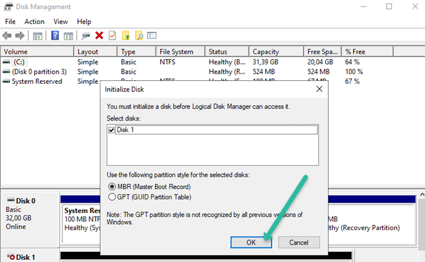

#### Creació carpeta personal

En aquesta carpeta es crearan les carpetes personals de cada usuari. La resta d'usuaris no haurien de poder accedir a les carpetes personals dels altres usuaris, tot i que les polítiques de cada organització poden establir excepcions a aquesta regla general. Exemple, a l'escola, els professors poden accedir a les carpetes personals dels alumnes en model lectura.

Crear la carpeta on ubicareu les carpetes personals, per exemple "home".

Els permisos d'una carpeta es propaguen a les subcarpetes i fitxers que conté, per tant, això s'anomena **herència**. En el cas de les carpetes personals, aixó seria un problema, ja que tots els usuaris tindrien accés a les carpetes personals dels altres usuaris. Per evitar-ho, cal desactivar l'herència de permisos a la carpeta personal.

En primer lloc, accedim a les propietats de la carpeta i a la pestanya "Seguretat" fem clic a "Opcions avançades".

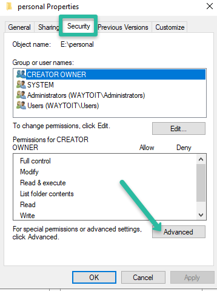

Es pot veure com la carpeta ha heretat els permisos de la carpeta pare.

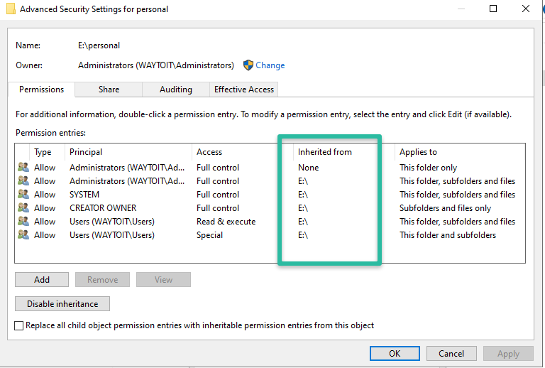

Per evitar-ho, el més senzill és sempre convertir els permisos heretats en permisos explícits, i després eliminar els permisos que no volem que tinguin accés a la carpeta.

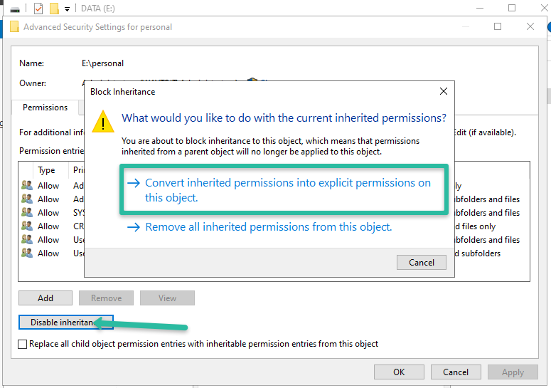

Quins permisos definirem?

- El grup "Domain User" tindrà permisos per llegir i escriure però **únicament a la carpeta actual**.
- El grup "Administrators" tindrà permisos de control total a la carpeta i subcarpetes (seria un exemple de política d'organització).
- **System** tindrà permisos de control total a la carpeta i subcarpetes (és un requisit del sistema operatiu).

Hi ha un permís que no cal definir que és que l'usuari propietari **"creator owner"** de la carpeta tingui control total a les subcarpetes i fitxers que creï dins la carpeta personal. Aquest permís s'assigna automàticament pel sistema operatiu.

Per modificar aquests permisos, usem l'opció "Edit" i modifiquem tant els permisos com la propagació a subcarpetes i fitxers.

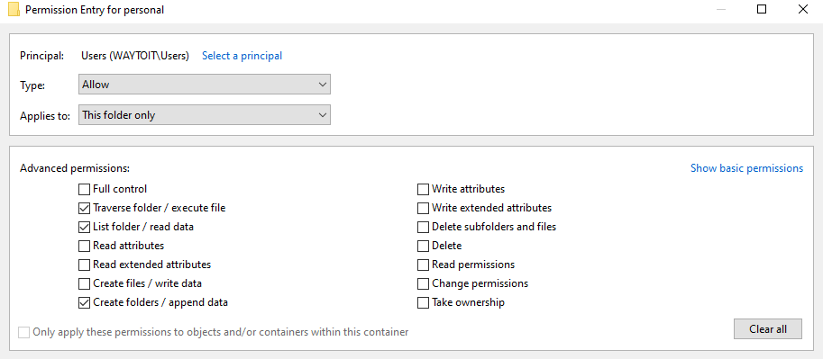

Al final, la configuració de permisos de la carpeta personal hauria de quedar així:

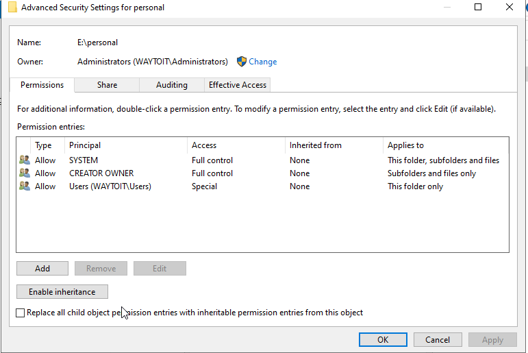

A continuació, compartirem la carpeta personal a la xarxa. Per fer-ho, feu clic amb el botó dret sobre la carpeta i seleccioneu "Propietats" -> "Compartir" -> "Compartir avançat". Marqueu l'opció "Comparteix aquesta carpeta" i feu clic a "Permisos" i donem permisos "Full Control" al grup "Domain Users". D'aquesta manera, tots els usuaris del domini podran accedir a la carpeta compartida.

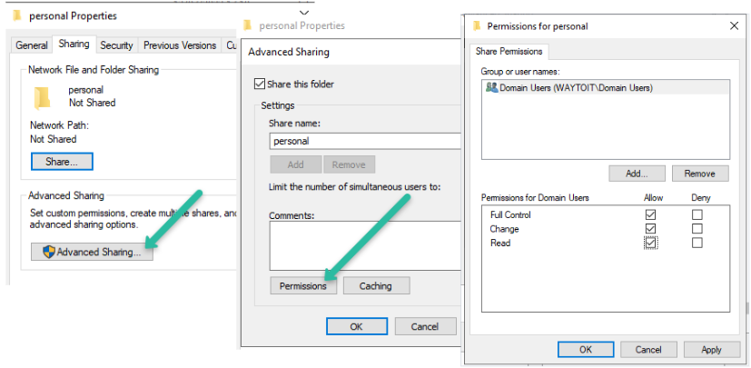

#### Creació carpeta perfil mòbil

La creació de la carpeta del perfils mòbils es fa de la mateixa manera que la creació de la carpeta personal, amb l'única diferència que el nom de la carpeta és diferent, per exemple "profiles" o "perfils". És a dir, es crea la carpeta, es comparteix a la xarxa i es defineixen els permisos de forma idèntica al que hem fet amb la carpeta personal.

### Plantilles d'usuari

Una plantilla no és res més que un usuari "tipus" per un grup d'usuaris. Per exemple, podem crear un usuari plantilla per a tots els professors i un altre usuari plantilla per a tots els alumnes. Com no és un usuari real, aquest usuari ha d'estar deshabilitat.

Com exemple, crearem la plantilla dels usuaris tècnics. Li posarem com a nom "_tecnic". El guionet inicial ens serveix per saber que és una plantilla i no un usuari real. A part, té l'avantatge que les plantilles apareixen a dalt del a llista d'objectes de la OU. A la fitxa de l'usuari, a la pestanya "Account" marcarem l'opció "Account is disabled".

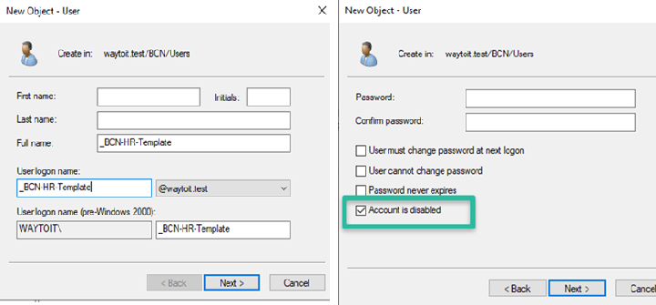

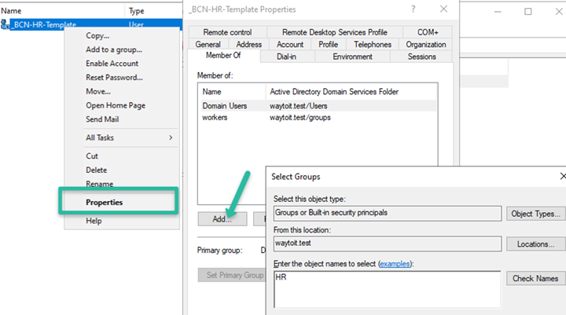

A la plantilla es defineix la pertinença als grups, en aquest cas, el grup "tecnics".

A la pestanya de "Profile" definirem la ruta de la carpeta personal i del perfil mòbil. La ruta de la carpeta personal i del perfil tindrà l'estructura següent:

```shell
\\nom_del_servidor\nom_del_recurs_compartit\%username%
```

El nom del recurs compartit serà "home" o "profiles" segons si és la carpeta personal o el perfil mòbil. El nom del servidor serà el nom que li hàgim posat al servidor, en el nostre cas "DC1". I què és %username%? Doncs és una variable que el sistema substitueix pel nom d'usuari de l'usuari que s'està creant. D'aquesta manera, quan es crea un usuari amb nom "joan.abella", la ruta de la carpeta personal serà:

Per tant, la rutes seran:

```shell
\\DC1\home\%username%
\\DC1\profiles\%username%
```

Vigileu no posar mai la ruta local, perquè li estaríem dient que cerqui el recurs a l'equip local i no al servidor.

### Creació d'usuaris a partir d'una plantilla

I com creem un usuari a partir d'una plantilla?

Doncs és molt senzill, feu clic amb el botó dret sobre la plantilla i seleccioneu "Copy". A continuació, només caldrà definir el nom de l'usuari i la contrasenya. Desmarcarem la pestanya "Account is disabled" i definirem la contrasenya. Normalment, marcarem l'opció "User must change password at next logon" per obligar a l'usuari a canviar la contrasenya en el primer accés.

La resta de propietats (pertinença als grups, perfils, carpetes personals, etc.) es copiaran de la plantilla.


## Equips

Els ordinadors també són objectes del directori actiu. Quan un equip s'uneix al domini, es crea un objecte amb el nom de l'equip dins la unitat organitzativa "Computers" (o la que hàgim definit). A partir d'aquest moment, l'equip podrà autenticar-se al domini i accedir als recursos compartits (usant el protocol Kerberos com a sistema autenticació).

Per aconseguir que l'equip estigui a la OU que volem, és millor aprovisionar els equips abans d'unir-los al domini. Per fer-ho, crearem un objecte amb el nom de l'equip dins la unitat organitzativa que correspongui. A continuació, quan un equip s'uneix al domini, el sistema busca un objecte amb el mateix nom i l'assigna a aquest objecte.

Dins de la OU creada pels equips, farem "Nou equip" i definirem el nom de l'equip.


### Agregar equips al domini

A l'equip client farem les següents accions:

- Comprovarem que el nom de l'equip coincideix amb el nom de l'objecte creat a la OU del domini.

- A configuració de xarxa, canviarem el DNS i posarem la IP del controlador del domini.

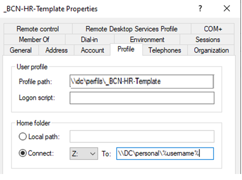

- A "Propiedades" de l'equip a "cambios en el dominio o el nombre del equipo", canviarem de membre de "Grupo de Trabajo" a membre de "Dominio" i posarem el nom del domini.

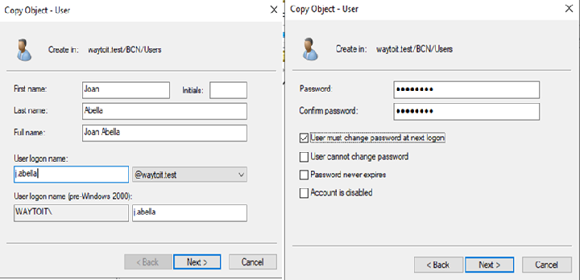

A continuació, ens demanarà unes credencials per agregar l'equip al domini. Per defecte, qualsevol usuari del domini pot agregar equips al domini, però normalment serà una acció que farà l'administrador del domini.

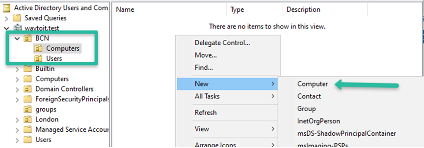

Una vegada acceptat, ens demanarà reiniciar l'equip. Un cop reiniciat, ja podrem validar-nos amb un usuari del domini. També podrem veure com l'equip s'ha agregat a la unitat organitzativa que hem definit.

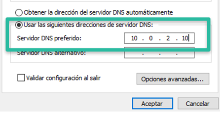

Un cop iniciada sessió amb un usuari del domini, podrem veure com el directori actiu ha creat la carpeta personal i el perfil mòbil de l'usuari a la xarxa.

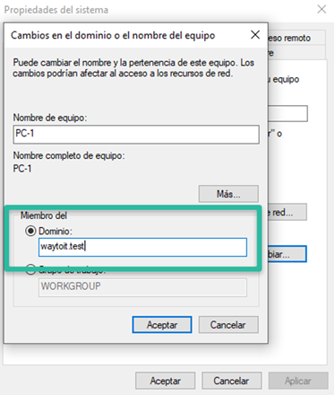

## Enllaços d'interès

- [Caurcy, I. Mastering Organizational Units (OUs) in Windows Server: Structure, Strategy & Best Practices](https://medium.com/@ihouelecaurcy/mastering-organizational-units-ous-in-windows-server-structure-strategy-best-practices-94bd74f4a22c)

- [Microsoft Learn: Active Directory security groups](https://learn.microsoft.com/en-us/windows-server/identity/ad-ds/manage/understand-security-groups)

- [Solvetic. Cómo crear usuarios y grupos dominio active directory en Windows Server 2019](https://www.solvetic.com/tutorials/article/7486-como-crear-usuarios-y-grupos-dominio-active-directory-en-windows-server-2019/)

- [Microsoft Learn: Implementar perfiles de usuario móviles](https://learn.microsoft.com/es-es/windows-server/storage/folder-redirection/deploy-roaming-user-profiles)
