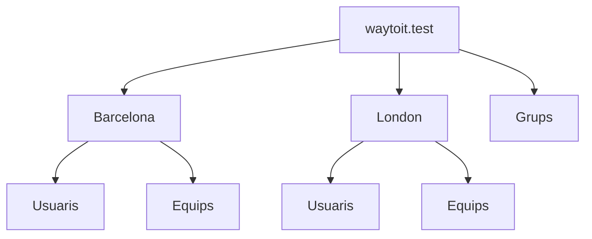

# UD9. Gestió d'usuaris i grups

RA2. Gestiona usuaris i grups de sistemes operatius en xarxa, interpretant especificacions i aplicant eines del sistema.

Durada prevista: 4 hores

## Introducció

Ara que ja tenim instal·lat el nostre directori actiu, és hora de començar a gestionar els usuaris i grups del sistema. En aquest apartat aprendrem a crear, modificar i eliminar usuaris i grups, així com a assignar permisos i rols adequats.

Prèviament, veurem un element bàsic de l'administració de serveis de directori: la unitat organitzativa (OU). Les unitats organitzatives ens permeten organitzar els nostres usuaris i grups de manera jeràrquica, facilitant la gestió i aplicació de polítiques.

## Unitats organitzatives (OU)

És un tipus especial d'objecte dins un directori. Són contenidors on ubicar la resta d'objectes del directori, com ara usuaris, grups, equips i altres unitats organitzatives. Les unitats organitzatives ens permeten organitzar els nostres usuaris i grups de manera jeràrquica, facilitant la gestió i aplicació de polítiques. Només poden contenir objectes del mateix domini.

I quina és la seva utilitat?

- En primer lloc, ens permeten organitzar els nostres usuaris i grups de manera jeràrquica, facilitant la gestió i aplicació de polítiques.
- Permeten aplicar polítiques de grup (GPO) a un conjunt d'usuaris o equips dins d'una unitat organitzativa específica.
- Faciliten la delegació de permisos d'administració a usuaris específics, permetent que només tinguin accés a gestionar els objectes dins d'aquesta unitat organitzativa.

Per tant, el primer pas abans de crear cap altre objecte és definir la nostra estructura d'unitats organitzatives. Això definirà l'estructura del domini.

### Estratègies d'organització

En general es recomana que l'estrctura del domini sigui un mirall de l'estructura de l'organització. Així podem pensar en diversos models:

- **model geogràfic**: si l'organització té diverses seus, podem crear una unitat organitzativa per a cada seu.

- **model departamental**: si l'organització té diversos departaments, podem crear una unitat organitzativa per a cada departament.

- **model mixt**: podem combinar els models anteriors, creant unitats organitzatives per a cada seu i dins de cada seu, unitats organitzatives per a cada departament.

Cal evitar en qualsevol cas crear unitats organitzatives innecessàries, ja que això pot complicar la gestió del directori.

A part d'aquest model hi ha una sèrie de bones pràctiques a aplicar:

- Separar usuaris i equips en unitats organitzatives diferents.
- Evitar usar els contenidors per defecte (com ara "Users" i "Computers") per ubicar els nostres objectes, ja que no permeten aplicar polítiques de grup ni delegar permisos d'administració.

Un exemple d'estructura jeràrquica d'unitats organitzatives podria ser el següent:

Com els grups seran comuns entre les dues seus, els ubiquem a una unitat organitzativa separada. D'aquesta manera, podrem assignar permisos a grups d'usuaris de les dues seus sense haver de duplicar els grups.

## Gestió Users and Computers

És la consola que permet gestionar els objectes del directori actiu. Des d'aquesta consola podrem crear, modificar i eliminar unitats organitzatives, usuaris i grups.

