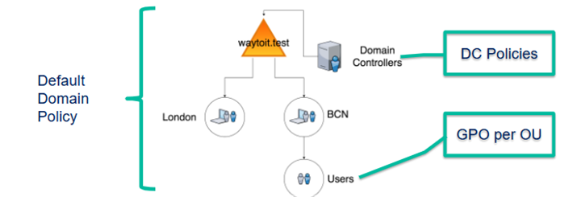
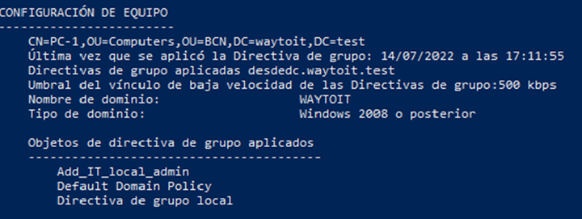
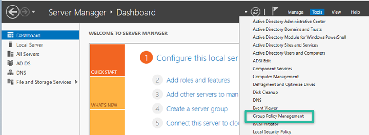
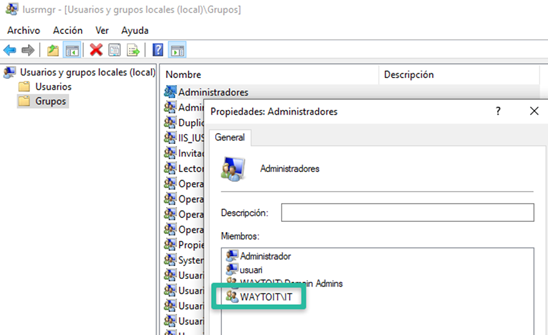
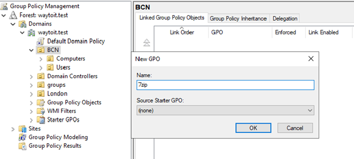
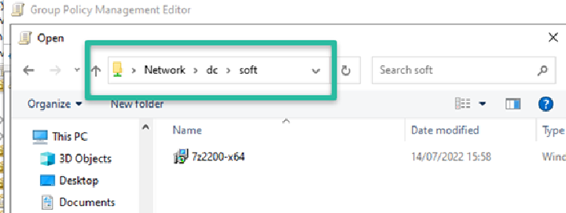
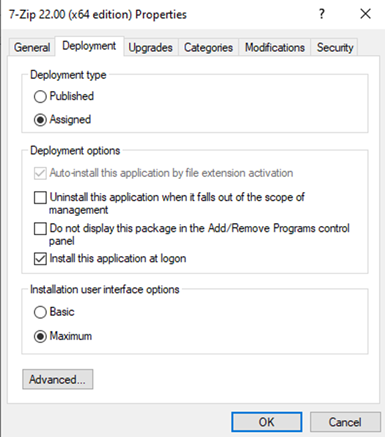
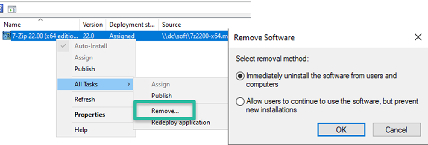

# UD 10. Gestió del directori actiu

RA3. Realitza tasques de gestió sobre dominis identificant necessitats i aplicant eines d'administració de dominis.

Durada prevista: 8 hores

## Introducció

En l'àmbit de la gestió de xarxes informàtiques professionals, dur a terme configuracions individuals a cada equip client de la xarxa  resulta del tot ineficient; per aquest motiu, en aquesta unitat estudiarem detalladament els Objectes de Directiva de Grup (GPO), unes eines essencials que ens permeten administrar i configurar de manera centralitzada i automatitzada tots els objectes i equips d'un domini.

Al llarg d'aquesta guia, aprendreu com crear, configurar i aplicar GPOs per gestionar de manera eficient els recursos i la seguretat de la vostra xarxa. També explorarem les millors pràctiques per a l'organització i manteniment dels GPOs, així com la resolució de problemes comuns que poden sorgir durant la seva implementació.

## Introducció a les Directives de grup (Group Policy Objects - GPOs)

Configuracions que permeten administrar els equips i usuaris d'un domini de manera centralitzada. Les GPOs poden aplicar-se a unitats organitzatives (OUs), grups d'usuaris o equips, i permeten establir polítiques de seguretat, configuracions de sistema, instal·lació de programari, redirecció de carpetes, entre altres. Fins i tot, es poden arribar a filtrar per característiques específiques dels equips (sistema operatiu, versió, etc.) usant WMI (Windows Management Instrumentation), tot i que això escapa del nostre àmbit d'estudi.

Quan vau estudiar Windows client a primer curs, ja vau veure les GPOs com una eina per configurar l'equip client, es tracta de les GPOs locals.

### Àmbit d'aplicació de les GPOs

L'àmbit d'aplicació de les GPOs es defineix per la jerarquia de l'Active Directory. Les GPOs poden aplicar-se a diferents nivells dins del domini, com ara:

- **Domini**: Les GPOs aplicades al nivell de domini afecten tots els usuaris i equips dins del domini.
- **Unitat Organitzativa (OU)**: Les GPOs aplicades a una OU afecten només els usuaris i equips dins d'aquesta unitat organitzativa específica.
- **Domain Controllers (DC)**: Les GPOs aplicades als Controladors de Domini afecten només els equips que actuen com a controladors de domini.



Dins un àmbit d'aplicació, les GPOs es poden filtrar per tal que només s'apliquin a determinats usuaris o equips, permeten una gestió molt més granular i evitar haver de crear múltiples GPOs per a diferents grups d'usuaris o equips amb necessitats similars.

### Jerarquia i herència de les GPOs

Les GPOs segueixen una jerarquia i herència dins de l'Active Directory. Quan es defineixen múltiples GPOs a diferents nivells (domini, OU, etc.), s'apliquen en un ordre específic, amb les GPOs més generals aplicant-se primer i les més específiques aplicant-se després. Això permet que les configuracions definides en GPOs més específiques puguin sobreescriure les configuracions definides en GPOs més generals. És a dir:

- GPOs de la màquina local
- GPOs del domini
- GPOs de les unitats organitzatives (OU)

Si dins un mateix nivell hi ha diverses GPOs, s'aplicaran en l'ordre que es defineixi a la consola de gestió de GPOs, i les configuracions de les GPOs aplicades més tard poden sobreescriure les configuracions de les GPOs aplicades abans, quedant el darrer valor que modifiqui una configuració (les GPO poden modificar configuracions existents o deixar-les intactes).

I què implica la herència? Doncs que si una GPO s'aplica a un nivell superior, com ara el domini, aquesta configuració s'aplicarà també a tots els nivells inferiors, com les unitats organitzatives (OUs) i els equips i usuaris dins d'aquestes OUs, tret que es configuri explícitament bloquejar l'herència.

### Aplicació i comprovació de l'aplicació de les GPOs

Les GPOs s'apliquen quan l'equip client s'inicia o bé quan l'usuari inicia sessió. Això vol dir, que una GPO no s'aplicarà el primer cop que el client arrenca, perquè en aquella primera arrencada la carrega. Per tant, si volem que les GPOs s'apliquin immediatament, podem forçar l'actualització de les polítiques amb la següent comanda executada en un terminal del client amb privilegis d'administrador:

```Powershell
gpupdate /force
```

Per comprovar que les GPOs s'han aplicat correctament als equips i usuaris del domini, podem utilitzar diverses eines i mètodes:

```Powershell
gpresult /r
```

Això ens mostrarà un resum de les GPOs aplicades a l'equip i a l'usuari actual, així com informació sobre l'àmbit d'aplicació i les configuracions específiques que s'han aplicat.



## Editor de GPOs (Group Policy Management Console - GPMC)

L'editor de GPOs és un consola a la que podeu accedir des del Server Manager a "Tools":



## Exemples de configuracions

Ara veurem una sèrie d'exemples de configuracions usant les GPO. A la unitat següent veurem encara més exemples, en aquell cas amb l'objectiu de compartir recursos de manera automatitzada.

### Exemple 1: Directives de contrasenyes

En aquest primer exemple veurem com es configuren les directives de seguretat relatives a les passwords dels usuaris. Aquesta sol ser una de les primeres configuracions que es realitzen en un domini, ja que és fonamental per garantir la seguretat dels comptes d'usuari i el compliment de les polítiques de seguretat establertes per l'organització.

Aquesta GPO l'aplicarem a nivell de domini, perquè volem que afecti a tots els usuaris del domini, independentment de a quina unitat organitzativa pertanyin. Per fer-ho, seguirem els següents passos:

1. Obrirem la consola de gestió de GPOs (GPMC) i navegarem fins al domini.
2. Seleccionarem la "Default Domain Policy" i farem clic amb el botó dret per editar-la.
3. A l'editor de GPOs, navegarem fins a "Computer Configuration" > "Policies" > "Windows Settings" > "Security Settings" > "Account Policies" > "Password Policy".

4. Configurarem les següents opcions segons les necessitats de l'organització:
   - **Enforce password history**: Estableix un nombre de contrasenyes anteriors que no es poden reutilitzar.
   - **Maximum password age**: Defineix el temps màxim que una contrasenya pot ser utilitzada abans de requerir un canvi.
   - **Minimum password age**: Marca el temps mínim que una contrasenya ha de ser utilitzada abans de poder ser canviada.
   - **Minimum password length**: Força la longitud mínima requerida per a les contrasenyes.
   - **Password must meet complexity requirements**: Activarem aquesta opció si es vol forçar que les contrasenyes compleixin amb els requisits de complexitat establerts.
   - **Relax minimum password length**: Per compatibilitat amb sistemes antics, la longitud mínima del passwords es fixava com a màxim en 14 caràcters. Activant aquesta propietat podem saltar-nos aquesta limitació.

> Al mòdul de `Seguretat Informàtica` ja heu estudiat el tema de les contrasenyes i com la longitud és més eficient que la complexitat i com és millor usar `passphrases` que contrasenyes complexes. Per tant, si voleu, podeu desactivar la complexitat i establir una longitud mínima de 18 o 20 caràcters, per exemple.

Un dubte que sorgeix sovint és perquè la configuració de la política de contrasenyes es troba dins de la branca de "Computer Configuration" i no dins de "User Configuration". La raó és que les polítiques de contrasenyes s'apliquen a nivell de màquina, ja que s'ha d'aplicar a l'inicir màquina, abans d'iniciar sessió l'usuari. Les directives d'usuari, en canvi, s'apliquen després d'iniciar sessió.

### Exemple 2: Administradors locals

Ens pot interessar que un determinat grup pugui fer accions d’administrador local en els equips clients del domini o de una seu, sense haver de ser administradors del domini, per exemple, per si ha den fer tasques de manteniment o instal·lació de programari. Per aconseguir-ho, podem usar un grup d'usuaris específic i afegir-lo al grup d'administradors locals dels equips clients mitjançant una GPO.

En aquest exemple, farem que els membres del grup "IT" del domini tinguin privilegis d'administrador local a tots els equips clients de la OU "BCN/Computers".

1. En primer lloc, crearem un grup d'usuaris anomenat "IT" dins del domini, si encara no existeix.
2. Obrirem la consola de gestió de GPOs (GPMC) i crearem una nova GPO anomenada "Administradors locals IT" a dins la OU "BCN/Computers".
3. Farem clic amb el botó dret sobre la GPO i seleccionarem "Edit" per editar-la.
4. A "Computer Configuration" > "Preferences" > "Local Users and Groups".
5. A "Administrators" farem clic amb el botó dret i seleccionarem "Action: Update" i a Members afegirem el grup "IT" del domini.

Un cop aplicada la GPO i actualitzades les polítiques als equips clients, els membres del grup "IT" tindran privilegis d'administrador local a tots els equips dins de la OU "BCN/Computers". Es pot comprovar o bé inicant sessió amb un usuari del grup "IT" en un equip client o bé si entrem com "Administrator" i obrim la consola de "Local Users and Groups" i comprovem que el grup "IT" apareix com a membre del grup d'administradors locals.



> Si us heu fixat en aquesta ocasió el que hem configurat és una GPO de tipus "Preferences" i no de tipus "Policies". La diferència és que les configuracions de tipus "Preferences" s'apliquen una sola vegada , mentre que les configuracions de tipus "Policies" s'apliquen de manera contínua i si localment es modifiquen, en tornar a carregar-se la GPO, es torna a aplicar el canvi.

## Exemple 3: Configuració del firewall dels equips clients

## Instal·lació desatesa de software

L’objectiu és centralitzar el procediment d’instal·lar o desinstal·lar programes al clients des del servidor, això estalvia haver d'anar equip per equip fent les instal·lacions. A més, permet tenir un control molt més gran de quin software s'instal·la a cada equip.

Bàsicament el sistema proporciona dos tipus d'instal·lació de software:

- **Assignada**: el software s'instal·la automàticament sense intervenció per part de l'usuari. Aquesta opció és ideal per a aplicacions que necessiten estar disponibles de forma obligatòria en els equips clients.
- **Publicada**: el software es posa a disposició de l'usuari, que pot triar instal·lar-lo des del "Control Panel" > "Programs and Features" > "Install a program from the network". Aquesta opció és útil per a aplicacions que no són essencials per a tots els usuaris, permetent-los decidir si volen instal·lar-les o no.

I quins tipus de fitxers necessitem per fer aquestes accions? Puc usar el típic `.exe` que descarrego d'internet? Doncs no, per poder fer una instal·lació desatesa necessitem un fitxer amb extensió `.msi`, que és el format de paquet d'instal·lació de Microsoft. Aquests fitxers `.msi` contenen tota la informació necessària per a la instal·lació del programari, incloent-hi els fitxers, les configuracions i les dependències.

El motiu és força evident, si despleguem un `.exe` que és un fitxer executable, estarem fent que els clients l'executin localment i aquest pot contenir qualsevol cosa i per tant, el risc és molt alt. En canvi, un fitxer `.msi` és un paquet d'instal·lació que segueix un format estandarditzat i és més segur per a la distribució de programari en entorns corporatius. També, tot i que és molt menys popular admet el format `.zap`.

Les diferències?

- El format `.msi` usa el motor de `Windows Installer` i suporta tant instal·lacions assignades com publicades.
- El format `.zap` (Zero Administration Package) és un format de paquet que només permet la publicació, no la instal·lació desatesa.

>També tenim una tercera manera de fer instal·lacions desateses, que és mitjançant scripts, però això ja ho veurem a la unitat 12, usant scripts de PowerShell i GPOs per indicar l'àmbit d'aplicació. Aquest mètode s'ha tornat molt popular des de l'aparició de l'eina `winget`.

### Creació unitat desplegament

Si volem desplegar software de forma desatesa, necessitem una unitat compartida a la xarxa on col·locarem els fitxers d'instal·lació `.msi` o `.zap`. Aquesta unitat ha de ser accessible per a tots els equips clients que necessiten instal·lar el programari.

Per tant, a la mateixa unitat on ja vam crear les carpetes de perfils i carpetes personals, crearem un nova carpeta anomenada `soft` i la configurarem de manera que tots els usuaris del domin tinguin permisos de lectura, però només els administradors del domini tinguin permisos d'escriptura. Això garantirà que els usuaris puguin accedir als fitxers d'instal·lació, però no podran modificar-los ni eliminar-los.

### Exemple 1: Instal·lació assignada

Com a primer exemple, veurem com fer una instal·lació assignada d'una aplicació a tots els equips clients d'una unitat organitzativa (OU) específica. En aquest cas, farem la instal·lació de l'aplicació "7-Zip" a tots els equips de la OU "BCN".

El primer pas serà descarregar-se el fitxer d'instal·lació `.msi` de l'aplicació "7-Zip" des del lloc [web oficial](https://www.7-zip.org/) i col·locar-lo a la unitat compartida `soft` que hem creat anteriorment.

Crearem la directiva com hem vist en els exemples anteriors, vinculant-la a la OU "BCN".



Editem la GPO i anem a "User Configuration" > "Policies" > "Software Settings" > "Software installation". Farem clic amb el botó dret i seleccionarem "New" > "Package". A continuació, navegarem fins a la **unitat compartida** `soft` i seleccionarem el fitxer `.msi` de l'aplicació "7-Zip".



> **Alerta**: És important que la ruta del fitxer sigui una ruta UNC (Universal Naming Convention), com ara `\\servidor\soft\7zip.msi`, i no una ruta local com `C:\soft\7zip.msi`. Sinó, els equips clients no podran accedir al fitxer d'instal·lació i la instal·lació fallarà.

A les opcions, veiem que apareixen tres opcions: "Assigned", "Published" i "Advanced". Seleccionarem "Advanced" perquè així podreu veure totes les opcions disponibles.



El primer que podem triar és si serà assignada o publicada. En aquest cas, seleccionarem "Assigned" per fer una instal·lació assignada. També podem configurar altres opcions, com si volem que si l'equip surt de l'àmbit d'aplicació de la GPO, el programari s'elimini automàticament o no. Aquesta opció és útil si volem que el programari només estigui disponible mentre l'equip estigui dins de la OU específica. A més, podem configurar que la instal·lació es faci automàticament en fer log-on l'usuari.

Un cop configurada la GPO i actualitzada en el client, reiniciem sessió i comprovarem que l'aplicació "7-Zip" s'ha instal·lat correctament a l'equip client. Podem verificar-ho buscant l'aplicació al menú d'inici o a la llista de programes instal·lats.

I com podem desinstal·lar l'aplicació? Si volem desinstal·lar l'aplicació, podem fer-ho eliminant la GPO o modificant-la per eliminar la instal·lació assignada. Quan l'equip client actualitzi les polítiques, l'aplicació s'eliminarà automàticament.



### Instal·lació publicada
