# AA1 Servidor de Fitxers

Durada prevista: 12 hores

La compartició de fitxers sempre ha estat un dels punts forts de les xarxes de Windows, en una xarxa entre iguals o de grup de treball és molt senzill compartir i publicar els recursos compartits, fins i tot no cal ni indicar les IP sinó que per nom de l'ordinador: per NetBIOS a sistemes antics i actualment per mDNS.

En entorns de directori actiu, l'habitual és que els recursos compartits estiguin centralitzats en un servidor de fitxers i la publicació dels recursos es fa mitjançant GPOs (Group Policy Objects).

## Com compartir recursos

Per compartir recursos a Windows en entorn Directori Actiu, les opcions són:

- Explorador de fitxers: fent clic dret sobre la carpeta i seleccionant "Propietats" i després la pestanya "Compartir".
- Server Manager: a la pestanya "File and Storage Services" i després a "Shares".
- PowerShell: amb el cmdlet `New-SmbShare`.

Preferentment usarem Server Manager ja que ens proporciona una forma senzilla i potent de compartir recursos, tot i que també veurem alguna prova feta amb PowerShell.

### Compartició de carpetes amb Server Manager

A Server Manager triar la pestanya "File and Storage Services" i després a "Shares". A la dreta hi ha l'opció "Tasks" i dins d'aquesta l'opció "New Share".


L’assistent ens permet triar quin tipus de compartició es vol fer (SMB o NFS) i de forma senzilla o amb opcions més complexes.


> Us pot sorprendre veure compartició recursos `NFS` en un entorn Windows, però Windows Server ha inclòs el servei de NFS per poder compartir recursos amb sistemes Linux i Unix.

Se selecciona la carpeta que es vol compartir i es defineix el nom del recurs compartit i ja ens proposarà permisos per defecte, que es poden modificar. També es poden definir permisos avançats i opcions de quota i filtratge de fitxers.


Podem triar diverses opcions sobre el recurs compartit:


- **Habilitar enumeració basada a l'accés**
Aquesta opció permet que el usuari que accedeix al recurs compartit vegi únicament les carpetes a las que té permís d'accés, sinó no podrà veure res ja que Windows Server l’amagarà. Aplica a les carpetes que es creen dins del recurs compartit i a les carpetes que ja existeixen. Per exemple, és molt útil per a la carpeta on es defineixen les carpetes personals dels usuaris, ja que cada usuari només veurà la seva carpeta i no les dels altres.

- **Permetre emmagatzematge en cache del recurs compartit**
Fa que els recursos compartits estiguin emmagatzemats a la cache del sistema permetent així la seva disponibilitat sense connexió.

- **Xifrar accés a dades**
Serveix per  incrementar la seguretat dels recursos compartits xifrant la comunicació.

Si s’especifiquen aquestes propietats, es poden aplicar directives específiques o les regles de classificació.

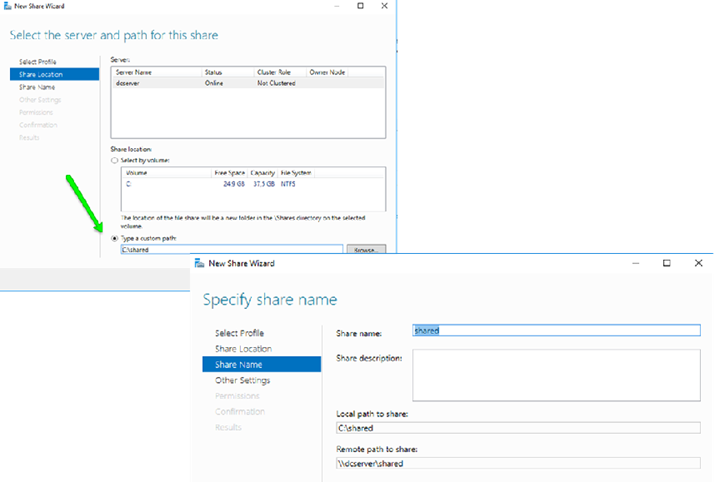

### Compartició de carpetes amb PowerShell

La sintaxi és la següent: `New-SmbShare -Name Nom -Path Ruta del recurs -Tipus d’accés`

Exemple: compartir carpeta shared a tots els usuaris de lectura i amb el grup informàtics amb full acces:

```powershell
New-SmbShare -Name shared -Path C:\shared -FullAccess informatics -ReadAccess Everyone
```

Les comandes de PowerShell relatives a compartició són:

- `New-SmbShare`: Crea una nova compartició SMB.
- `Get-SmbShare`: Mostra les comparticions SMB existents.
- `Set-SmbShare`: Modifica les propietats d'una compartició SMB existent.
- `Remove-SmbShare`: Elimina una compartició SMB existent.

## Quotes d'emmagatzematge

### Quotes de disc NTFS

La quota de disc és una característica que permet limitar l'espai de disc que pot utilitzar un usuari o grup d'usuaris. Aquesta característica és útil per evitar que un usuari consumeixi tot l'espai disponible al servidor de fitxers, afectant així a la resta d'usuaris.

Les quotes NTFS es poden configurar per usuari i afecten a tota la unitat de disc, no només a una carpeta concreta. A més, les quotes es poden configurar per grups d'usuaris, permetent així una gestió més eficient de l'espai de disc.

Per configurar la quota NTFS cal anar a les propietats del volum.

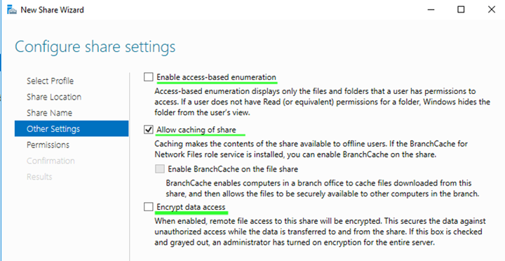

La quota només es pot aplicar de forma general, aplicant un límit i un límit d’avís. A `Quota Entries` podem veure totes les configuracions de quota creades per un volum.

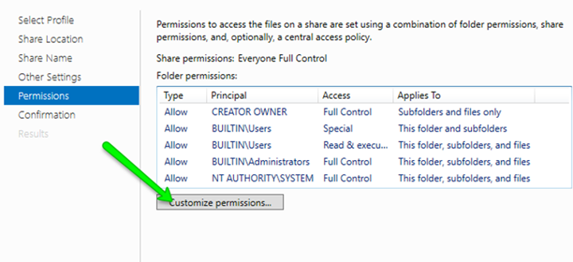

Les quotes es poden establir únicament per usuaris.

### Quotes de disc per carpeta (FSRM)

Les quotes NTFS no són suficients en un entorns de servidor de fitxers, ja que no permeten establir quotes per carpeta, només per volum. Per això, Windows Server inclou el servei FSRM (File Server Resource Manager) que permet establir quotes per carpeta i grups d'usuaris.

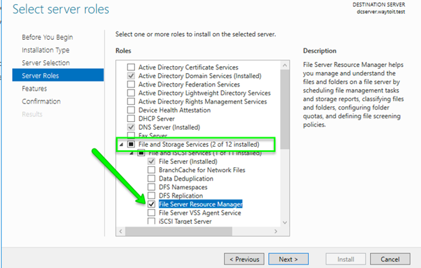

Si necessitem limitar l'espai de disc tant per usuari com per carpetes, s'haurà de combinar l'ús de totes dues eines.

En Tools anar a File Server Resource Manager. A la consola anar a `Quota Management` i anar a `Quota Templates`. També es pot fer des del Server Manager.

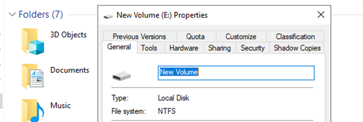

Per crear una nova Quota Template, configurarem les següents dades:

- Nom: Hard 250 MB Quota
- Limit: 250 MB
- En Add Threshold clicar sobre Report tab. Seleccionar generar informes (Generate Reports) per arxius duplicats, arxius grans, arxius poc usats i enviar informes a l’usuari que excedeixi la quota.

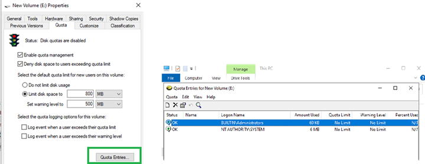

Es poden definir llindars d’avís i llindars de bloqueig, així com definir accions a realitzar quan s’arribi a aquests llindars. Per exemple, enviar un correu electrònic a l’usuari i al administrador del sistema. Així com la generació d'informes.

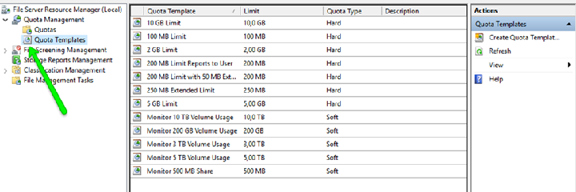

Per aplicar la quota a una carpeta concreta, anar a `Quota Management` i clicar sobre `Create Quota`. Seleccionar la carpeta i la quota template que s’ha creat anteriorment.

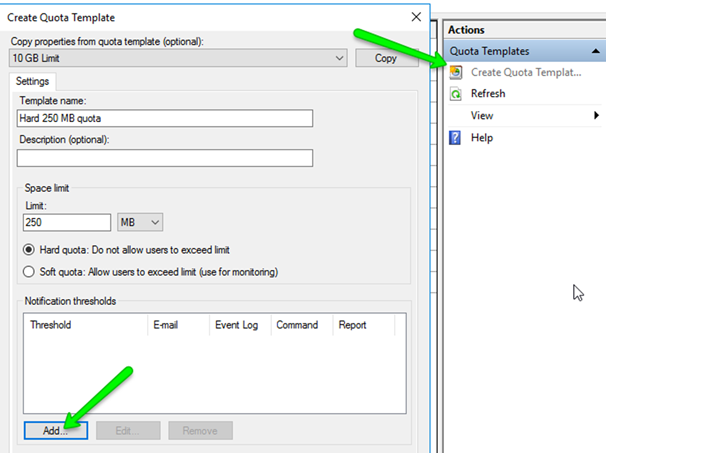

Per provar la quota, es pot mirar de copiar un fitxer gran a la carpeta amb quota i veure com es genera l’avís i el bloqueig de l’accés.

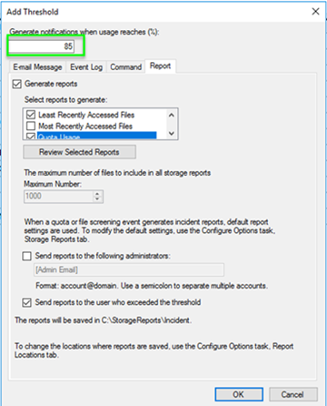

File Server Resource Manager també permet establir limitacions de tipus de fitxer (usa l'extensió de fitxer) i altres funcionalitats com eliminar del recurs compartit fitxers per antiguitat o que faci temps que no s’han utilitzat. També permet generar informes sobre l’ús del recurs compartit i sobre els fitxers que conté.

## Desplegament dels recursos compartits amb GPOs

A la plantilla de creació d'usuari ja es va configurar la carpeta personal i aquesta és accessible des de l'explorador de fitxers de l'usuari. De la mateixa manera, si compartim carpetes per tots els usuaris o per grups, volem que aquestes carpetes estiguin disponibles a l'explorador de fitxers de l'usuari. Per això, es poden desplegar els recursos compartits mitjançant GPOs.

Definirem una nova GPO i la vincularem a l'OU on hi ha els usuaris que volem que tinguin accés al recurs compartit o si ha de ser per tots els usuaris del domini a l'arrel del domini.

A la GPO anirem a `User Configuration` -> `Preferences` -> `Windows Settings` -> `Drive Maps`. Clicar amb el botó dret i seleccionar `New` -> `Mapped Drive`.

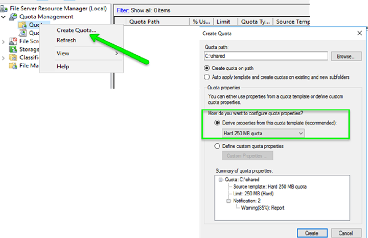

Un cop aplicada la GPO, quan l'usuari iniciï sessió, el recurs compartit es maparà automàticament a l'explorador de fitxers.

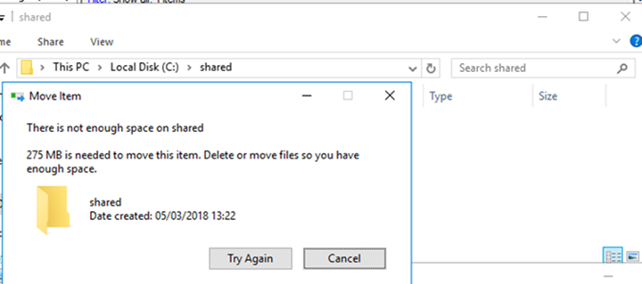

## Redirecció de carpetes

Els perfils mòbils vam veure que permeten que un usuari mantingui el seu entorn de treball en diferents màquines. L’inconvenient dels perfils mòbils, és que el carrega a l'equip client a l'iniciar sessió i l'envia cap el servidor en tancar. Això provoca que si el perfil és gran, l’inici i tancament de sessió sigui lent.

Com alternativa, enlloc de fer servir perfils mòbils, es poden redirigir carpetes del perfil a un recurs compartit del servidor.

Redirigir carpetes permet que apuntin directament a una ruta del servidor, redirigint parcial o totalment tot el perfil dels usuaris. Com qualsevol carpeta compartida, es pot habilitar l’accés sense connexió per treballar en mode sincronitzat.

La redirecció de carpetes es fa implementant una GPO i configurant la redirecció de carpetes a la ruta del recurs compartit. A la GPO anirem a `User Configuration` -> `Policies` -> `Windows Settings` -> `Folder Redirection`. Clicar amb el botó dret sobre la carpeta que es vol redirigir i seleccionar `Properties`.

Es poden redirigir part de les carpetes del perfil o totes, i es poden definir opcions de redirecció per a cada carpeta.

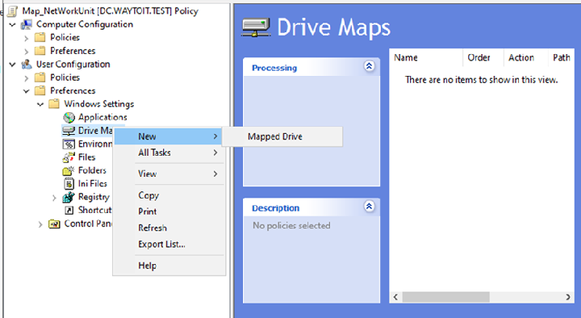

Per cada carpeta que es vulgui redirigir, s'indica on, sent la carpeta personal de l'usuari l'opció més senzilla.

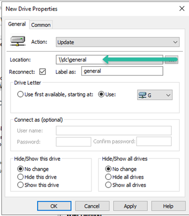

D'aquesta manera, podem prescindir dels perfils mòbils i redirigir aquelles carepetes com Documents, Desktop, Pictures, etc. a un recurs compartit del servidor.

## Eliminació perfils antics

Un problema en entorns on els usuaris canvien sovint d'equip, és que els perfils antics queden als clients ocupant espai innecessari. Per això, és recomanable eliminar els perfils antics dels usuaris que ja no treballen a l'empresa o que ja no necessiten el seu perfil.

Per evitar això, podem aplicar una GPO que esborri els perfils després de x temps sense accés. Per fer-ho, a la GPO anirem a `Computer Configuration` -> `Policies` -> `Administrative Templates` -> `System` -> `User Profiles`. Clicar sobre `Delete user profiles older than a specified number of days on system restart` i habilitar-la indicant el nombre de dies.

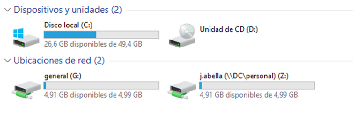
