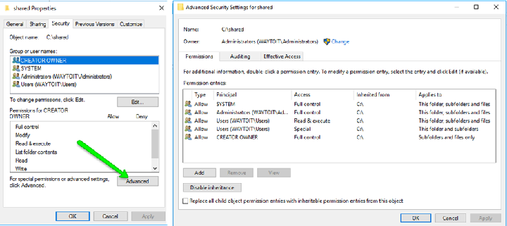
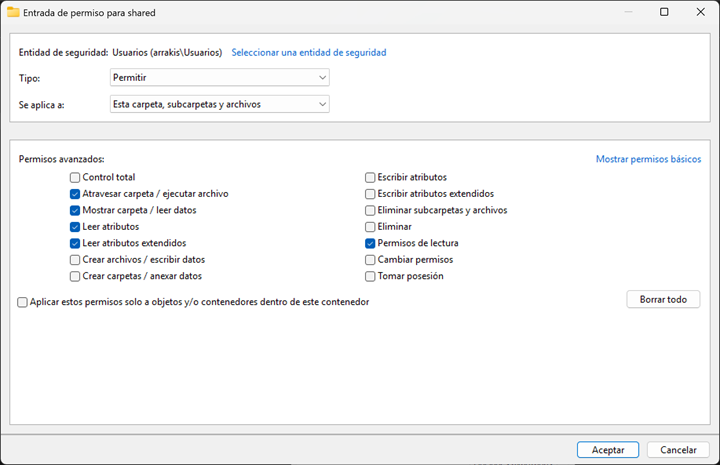
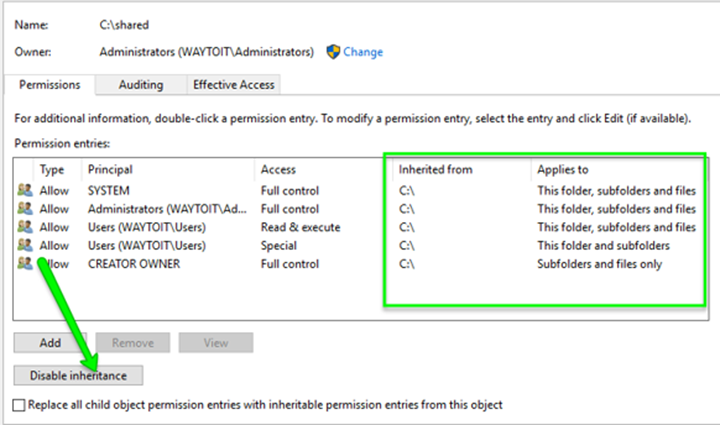
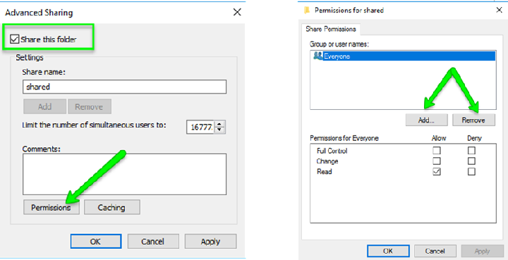
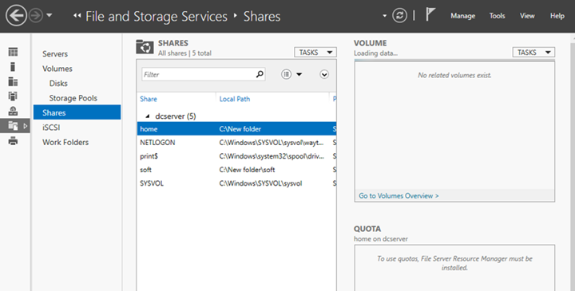
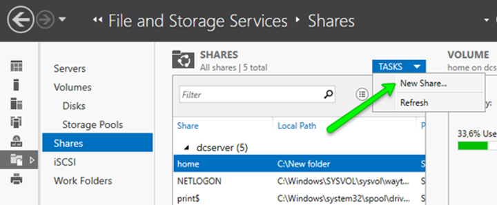
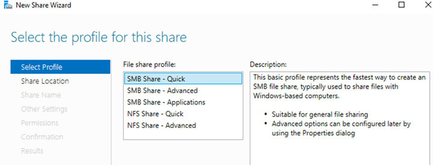

# AA1 Servidor de Fitxers

La compartició de fitxers sempre ha estat un dels punts forts de les xarxes de Windows, en una xarxa entre iguals o de grup de treball és molt senzill compartir i publicar els recursos compartits, fins i tot no cal ni indicar les IP sinó que per nom de l'ordinador: per NetBIOS a sistemes antics i actualment per mDNS.

En entorns de directori actiu, l'habitual és que els recursos compartits estiguin centralitzats en un servidor de fitxers i la publicació dels recursos es fa mitjançant GPOs (Group Policy Objects).

## Permisos i herència

El sistema de fitxers NTFS permet assignar permisos a fitxers i carpetes, i aquests permisos es poden heretar de la carpeta pare. A més, els permisos es poden assignar a usuaris o grups d'usuaris, ja que NTFS usa el model ACL (Access Control List) per assignar permisos. Els permisos bàsics que es poden assignar són: lectura, escriptura, modificació i control total. Aquests permisos es poden desgranar en permisos més modulars.

Normalment quan es defineix un recurs compartit, és bona pràctica eliminar l'herència de permisos i assignar els permisos necessaris a usuaris o grups d'usuaris, ja que si es deixa l'herència, els permisos de la carpeta pare poden afectar al recurs compartit.

## Quotes de disc

La quota de disc és una característica que permet limitar l'espai de disc que pot utilitzar un usuari o grup d'usuaris. Aquesta característica és útil per evitar que un usuari consumeixi tot l'espai disponible al servidor de fitxers, afectant així a la resta d'usuaris.

Les quotes NTFS es poden configurar per usuari i afecten a tota la unitat de disc, no només a una carpeta concreta. A més, les quotes es poden configurar per grups d'usuaris, permetent així una gestió més eficient de l'espai de disc.

Si es vol aplicar una mateixa quota acada integrant d'un grup específic tingui el mateix límit individual (per exemple, 5 GB per persona), es pots importar de manera massiva:

1. Obre l'Explorador de fitxers, fes clic dret sobre el disc NTFS que vols configurar i selecciona Propietats.

2. Ves a la pestanya Quota i fes clic a Mostra la configuració de quota.

3. Marca la casella Habilita l'administració de quotes (i Denega espai de disc... si vols bloquejar-los quan es quedin sense espai).

Fes clic al botó Entrades de quota... (a baix a l'esquerra).

A la nova finestra, ves al menú superior i selecciona Quota > Nova entrada de quota....

Al quadre de selecció, escriu el nom del teu Grup d'usuaris i fes clic a Comprova els noms.

⚠️ Nota: El Windows no afegirà el grup com una entitat única; el que farà serà buscar tots els usuaris que pertanyen a aquest grup en aquell moment i els afegirà individualment a la llista.

Defineix el límit d'espai i el nivell d'advertiment, i fes clic a D'acord.

## Com compartir recursos

Per compartir recursos a Windows en entorn Directori Actiu, les opcions són:

- Explorador de fitxers: fent clic dret sobre la carpeta i seleccionant "Propietats" i després la pestanya "Compartir".
- Server Manager: a la pestanya "File and Storage Services" i després a "Shares".
- PowerShell: amb el cmdlet `New-SmbShare`.

Preferentment usarem Server Manager ja que ens proporciona una forma senzilla i potent de compartir recursos, tot i que també veurem alguna prova feta amb PowerShell.

### Compartició de carpetes amb Server Manager

A Server Manager triar la pestanya "File and Storage Services" i després a "Shares". A la dreta hi ha l'opció "Tasks" i dins d'aquesta l'opció "New Share".

L’assistent ens permet triar quin tipus de compartició es vol fer (SMB o NFS) i de forma senzilla o amb opcions més complexes.

> Us pot sorprendre veure compartició recursos `NFS` en un entorn Windows, però Windows Server ha inclòs el servei de NFS per poder compartir recursos amb sistemes Linux i Unix.

Se selecciona la carpeta que es vol compartir i es defineix el nom del recurs compartit i ja ens proposarà permisos per defecte, que es poden modificar. També es poden definir permisos avançats i opcions de quota i filtratge de fitxers.

Podem triar diverses opcions sobre el recurs compartit:

- **Habilitar enumeració basada a l'accés**
Aquesta opció permet que el usuari que accedeix al recurs compartit vegi únicament les carpetes a las que té permís d'accés, sinó no podrà veure res ja que Windows Server l’amagarà.

- **Permetre emmagatzematge en cache del recurs compartit**
Fa que els recursos compartits estiguin emmagatzemats a la cache del sistema permetent així la seva disponibilitat sense connexió.

- **Xifrar accés a dades**
Serveix per  incrementar la seguretat dels recursos compartits xifrant la comunicació.
