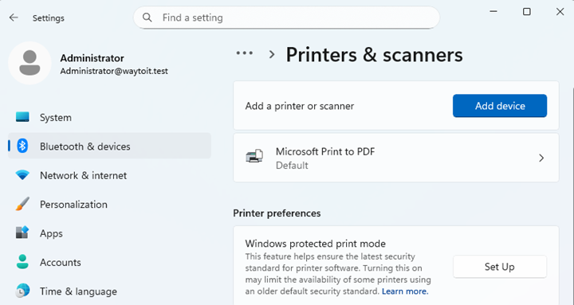
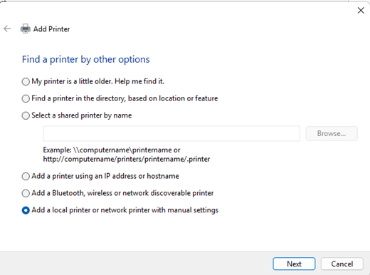
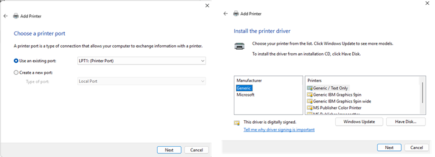
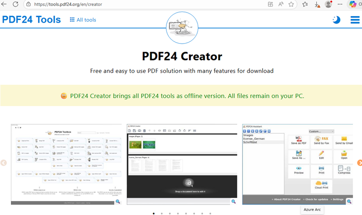
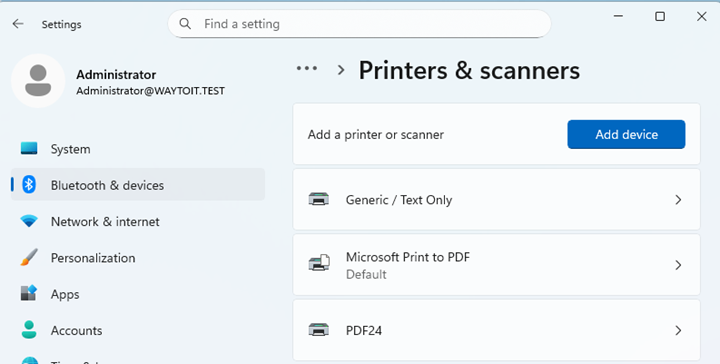

# Servidor Impressió

## Introducció

A una organització un ús eficient de les impressores és fonamental per a la productivitat i la gestió de recursos. Un servidor d'impressió centralitza la gestió de les impressores, permetent als usuaris enviar treballs d'impressió des de qualsevol lloc dins de la xarxa i facilitant l'administració dels dispositius d'impressió.

En aquesta activitat veurem com configurar un servidor d'impressió en un entorn de Directori Actiu, com crear cues d'impressió amb múltiples impressores i com desplegar les impressores als usuaris de manera eficient mitjançant polítiques de grup.

## Pas previ: instal·lació impressora en el servidor

Per agregar una impressora, cal anar "Setting", "Devices", "Printers & Scanners" i fent botó dret seleccionar "Add Printer". Es pot afegir una impressora local o de xarxa, i es poden instal·lar els controladors necessaris.

Per instal·lar la impressora, en primer lloc ens pregunta on està connectada la impressora, si és local o de xarxa. Si és de xarxa, caldrà introduir la IP o el nom del servidor on està connectada. Un cop seleccionada la impressora, es poden instal·lar els controladors corresponents.

El següent pas és seleccionar el fabricant i el model de la impressora, per fer això, es triar l'opció "Install a new driver". Aquí ens apareixerà una llista de fabricants i models d'impressores.

En el nostre cas, per poder fer les proves corresponents, instal·larem una impressora virtual "PDF24" al servidor Windows Server 2025. Aquesta impressora ens permetrà generar documents PDF.

En aquesta [guia](https://github.com/cfugarolas/activitats/blob/main/activitat3/pdf24.md) teniu l'explicació de com instal·lar la impressora virtual PDF24 al Server 2025.

Un cop fet això, ens apareixerà a la llista d'impressores disponibles.

## Compartició bàsica d'impressores

La compartició bàsica usant el protocol SMB, es pot usar tant en entorns de servidor-client, com en entorns de grup de treball, on un equip Windows 10 o 11 comparteix una impressora amb altres equips de la xarxa. Per compartir una impressora, s'accedeix a les opcions "Impressores i escàners" del sistema operatiu, es selecciona la impressora que es vol compartir i se selecciona l'opció "Administrar".

A continuació, es fa clic a "Propietats de la impressora" i es selecciona la pestanya "Compartir". Aquí es marca l'opció "Comparteix aquesta impressora" i es pot assignar un nom de compartició que serà visible per als altres equips de la xarxa.

## Servidor d'impressió

Si disposem d'un entorn amb un servidor Windows Server, podem configurar un servidor d'impressió que centralitzi la gestió de les impressores. Això permet als administradors controlar l'accés a les impressores, gestionar els controladors i monitoritzar l'ús de les impressores.

Un cop instal·lat el rol, s'accedeix a la consola de "Gestió d'impressores" o "Print Management".

Un cop fet això, ens apareixerà a la llista d'impressores disponibles.

## Enllaços d'interès

- [PDF24: Instal·lació de la impressora virtual PDF24](https://www.pdf24.org/es/help/install-pdf24-printer)

- [99RDP: How to Install and Configure a Print Server on Windows Server](https://99rdp.com/blog/how-to-install-and-configure-a-print-server-on-windows-server/)

- [El Profe Tech: CURSO WINDOWS SERVER 2022 DESDE CERO | INSTALAR Y CONFIGURAR UN SERVIDOR DE IMPRESION](https://youtu.be/6N8FGEVeRP8?si=bAw8GvKXNRWhd5sZ)

- [Solvetic: Crear configurar servidor de impresión en Windows Server 2016](https://www.solvetic.com/tutoriales/article/3349-crear-configurar-servidor-de-impresion-windows-server-2016/)
