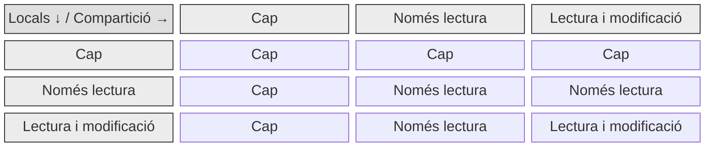

# UD 11. Compartició de recursos en entorns Windows

RA4. Gestiona els recursos compartits del sistema, interpretant especificacions i determinant nivells de seguretat.

Durada prevista: 16 hores

## Introducció a la unitat

La compartició de recursos en xarxa és una de les utilitats o raons principals perquè els sistemes operatius es connectin en xarxa. Es poden compartir tot tipus de recusos, encara que els recursos més habituals són:

- Arxius i carpetes
- Impressores

A la unitat de compartició de recursos a Linux ja vam veure els avantatges de treballar amb recursos compartirs, que resumint són la reducció de costos, la facilitat d'accés, la facilitat de gestió i seguretat i la consistència de dades.

## Protocols

A l'ecosistema Windows el protocol de compartició de recursos és SMB (Server Message Block), que és un protocol de xarxa que permet compartir fitxers, impressores i altres recursos entre ordinadors.

La versió  més recent és SMB 3.1.1, que s'inclou a partir de Windows Server 2016 i Windows 10. Amb Windows 11 i Server 2025 s'ha presentat la versió SMB 3.1.1 sobre Quic, que millora la velocitat i la seguretat de les connexions a l'usar UDP en lloc de TCP. A més, SMB 3.1.1 sobre Quic permet la connexió a recursos compartits usant TLS 1.3 per xifrar les dades.

## Permisos dels recursos compartits

Sobre un recurs compartit hi afecten dos tipus de permisos: els permisos del sistema de fitxers NTFS i els permisos del recurs compartit. Els permisos NTFS s'apliquen a nivell de sistema de fitxers i afecten tant quan l'accés és local com a través de la xarxa, mentre que els permisos del recurs compartit s'apliquen a nivell de xarxa.

## Permisos i herència

El sistema de fitxers NTFS permet assignar permisos a fitxers i carpetes, i aquests permisos es poden heretar de la carpeta pare. A més, els permisos es poden assignar a usuaris o grups d'usuaris, ja que NTFS usa el model ACL (Access Control List) per assignar permisos. Els permisos bàsics que es poden assignar són: lectura, escriptura, modificació i control total. Aquests permisos es poden desgranar en permisos més modulars.

Normalment quan es defineix un recurs compartit, és bona pràctica eliminar l'herència de permisos i assignar els permisos necessaris a usuaris o grups d'usuaris, ja que si es deixa l'herència, els permisos de la carpeta pare poden afectar al recurs compartit.

Els permisos compartits són molt més limitats que els permisos NTFS, ja que només permeten assignar tres tipus de permisos: cap, només lectura i lectura i modificació.

> Tot i que des de l'explorador de fitxers hi ha l'opció de compartir recursos simple, com a usuaris avançats és recomanable utilitzar la compartició avançada, ja que permet assignar permisos més detallats i controlar millor l'accés als recursos compartits.

Per aquest motiu i atès que en entorns de directori actiu l'accés als servidors de fitxers (o al propi controlador de domini si assumeix el rol) està molt limitat, compartim de forma laxa (permisos totals a tothom) i controlem l'accés amb els permisos NTFS, que són molt potents.

En intranets corporatives grans l'habitual és tenir equips servidors dedicats com servidors de fixers, però en entorns petits o de laboratori, el controlador de domini també pot assumir el rol de servidor de fitxers i d'impressió.

A continuació veurem com configurar en el nostre servidor Windows els recursos compartits:

1. [Servidor de fitxers](AA1-ServidorFitxer.md)

2. [Servidor d'impressió](AA2-ServidorImpressio.md)
