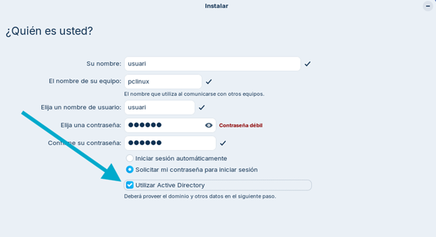
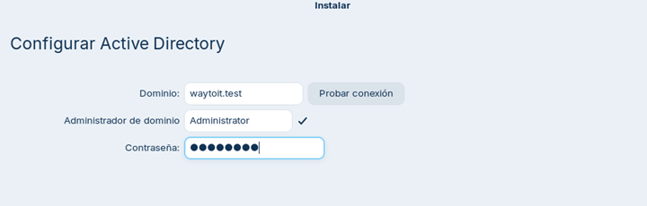
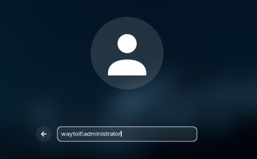
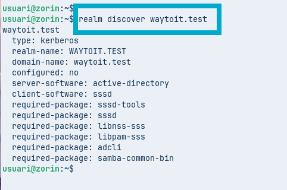
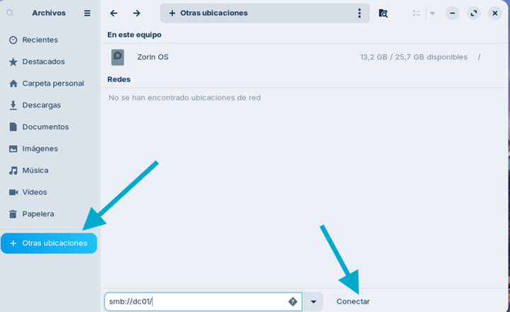
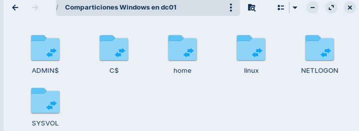

# UD 13. Integració client Linux en un Actiu Directory

RA6. Integra un client Linux en un entorn de Directori Actiu, interpretant especificacions i aplicant eines del sistema.

Durada prevista: 4 hores

## Introducció

Els entorns de Directori Actiu ofereixen una manera centralitzada de gestionar usuaris, grups i recursos dins d'una organització. Integrar un client Linux en un Directori Actiu permet als usuaris autenticar-se amb les seves credencials d'AD i accedir a recursos compartits de manera segura.

Ubuntu és una de les distribucions que més facilita aquesta possibilitat així que d’altres derivades com Zorin també ho permeten de forma molt senzilla. Amb la versió 22.04 es va presentar Adsys que requereix la subscripció a [Ubuntu Pro](https://ubuntu.com/pro) i que inclou suport per GPOs.

A la resta de distribucions, com Zorin, caldrà fer servir eines com `sssd` per integrar-se amb el Directori Actiu.

## Activitat

Com a controlador de domini (DC) usem un Windows Server 2025 i com equip client un Zorin Core. Tots dos equips s'han de poder veure, bé configurant-se en "Xarxa NAT" si es troben al mateix equip físic o bé usant "Adaptador pont" si es troben en equips diferents.

Veurem les dues opcions:

- Agregar-lo durant el procés d’instal·lació.
- Agregar un equip Zorin ja instal·lat.

En qualsevol dels casos, el primer que farem serà aprovisionar el Zorin a la OU corresponent dins el Directori Actiu, per exemple `BCN/Computers` triant un nom d’equip que no estigui repetit dins del domini, per exemple `pclinux`.

### Agregar Zorin durant el procés d’instal·lació

Triarem **Try Zorin** per poder configurar la xarxa per poder agregar-lo al AD. Anem a la configuració de xarxa i aquí haurem de fer que el DNS apunti a la IP del controlador de domini (DC). És molt important assegurar-se que es desmarca l'opció Automàtic.


Un cop ens assegurem que l’equip Zorin està usant el DC com DNS comencem la instal·lació, que similar a d'altres que ja haureu fet anteriorment. El punt important arriba quan ens demana el nom del primer usuari i el de l'equip. Aquí hem de posar el nom de l’equip que **anteriorment hem aprovisionat** dins del domini i el nom d’usuari local que volem crear, per exemple `usuari`.



La diferència és que marquem l'opció **Usar Active Directory**. Aquí ens demanarà en primer lloc el nom del domini, un cop introduït doneu a "Probar conexión" per verificar que l’equip pot contactar amb el DC. Si tot és correcte, ens demanarà un usuari i contrasenya amb permisos per agregar equips al domini, per exemple `Administrator`.



Quan acabi el procés d'instal·lació caldrà reiniciar l'equip. Per iniciar sessió introduirem el nom d'usuari del domini amb el format `domini\usuari` i la contrasenya corresponent. Si tot ha anat bé, podrem iniciar sessió amb un usuari del Directori Actiu.



Si obrim un terminal i fem `id` veurem que l’usuari té un UID i GID assignats pel Directori Actiu, però que encara que hem entrat com l'administrador del domini, no tenim permisos d'administrador a l'equip Zorin.

### Agregar un equip Zorin ja instal·lat

El primer pas és configurar la xarxa per tal que el DNS apunti al controlador de domini (DC). Un cop fet això, obrim un terminal i fem:

```bash
sudo apt install sssd-ad sssd-tools realmd adcli
```

SSSD (System Security Services Daemon) és el servei que permet connectar-se a directoris remots, en aquest cas el directori actiu.

Ara cal canviar el nom del client, per tal que el seu FQDN (nom complet) pertanyi al domini del directori actiu al que el volem afegir.

```bash
sudo hostnamectl set-hostname pclinux.waytoit.test
```

És molt important comprovar que tots dos equips correctament sincronitzats pel que respecte l’hora, si no, Kerberos (el procés de autenticació) fallarà.

A continuació comprovem si es detecta el domini:

```bash
realm discover waytoit.test
```

Hauria de mostrar-nos informació del domini, com el nom del controlador de domini, el tipus de domini i altres detalls.



Si s'ha detectat correctament, podem unir l'equip al domini amb:

```bash
sudo realm join waytoit.test
```

Us demanarà la contrasenya de l'usuari Administrator del domini. Un cop introduïda, l'equip Zorin s'haurà unit al domini.

Afegim la configuració perquè quan un usuari del Directori Actiu es connecti al client Zorin per primer cop, es defineixi la carpeta personal.

```bash
sudo pam-auth-update --enable mkhomedir
```

Per últim, **reiniciem l'equip** i provem d'iniciar sessió amb un usuari del Directori Actiu. Recordeu que el format per iniciar sessió és `domini\usuari`.

## Accedint a les unitats de xarxa

Finalment, si volem que els usuaris puguin accedir als recursos compartits des del directori actiu, caldrà usar la connexió samba des de l’explorador d’arxius. Si feu servir Ubuntu no caldrà instal·lar res, però si feu servir Zorin caldrà instal·lar un paquet per poder connectar-nos des de l’explorador d’arxius:

```bash
sudo apt update && sudo apt install python3-smbc
```





## Enllaços d'interès

- [Documentació Zorin: join active directory](https://help.zorin.com/docs/system-software/join-active-directory-ldap/)

- [Matt Glass: Ubuntu Domain Join](https://mattglass-it.com/ubuntu-domain-join/)
