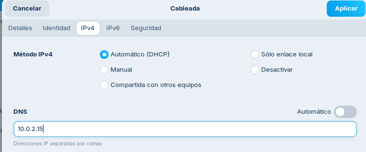

# Integració client Linux en un Actiu Directory

## Introducció

Els entorns de Directori Actiu ofereixen una manera centralitzada de gestionar usuaris, grups i recursos dins d'una organització. Integrar un client Linux en un Directori Actiu permet als usuaris autenticar-se amb les seves credencials d'AD i accedir a recursos compartits de manera segura.

Ubuntu és una de les distribucions que més facilita aquesta possibilitat així que d’altres derivades com Zorin també ho permeten de forma molt senzilla. Amb la versió 22.04 es va presentar Adsys que requereix la subscripció a [Ubuntu Pro](https://ubuntu.com/pro) i que inclou suport per GPOs.

## Activitat

Com a controlador de domini (DC) usem un Windows Server 2025 i com equip client un Zorin Core. Tots dos equips s'han de poder veure, bé configurant-se en "Xarxa NAT" si es troben al mateix equip físic o bé usant "Adaptador pont" si es troben en equips diferents.

Veurem les dues opcions:

- Agregar-lo durant el procés d’instal·lació.
- Agregar un equip Zorin ja instal·lat.

### Agregar Zorin durant el procés d’instal·lació

Triarem **Try Zorin** per poder configurar la xarxa per poder agregar-lo al AD. Anem a la configuració de xarxa i aquí haurem de fer que el DNS apunti a la IP del controlador de domini (DC). És molt important assegurar-se que es desmarca l'opció Automàtic.

