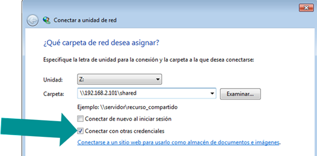

# UD 14. Servidor Samba

RA6. Configura un servidor Samba per compartir recursos amb clients Windows, interpretant especificacions i aplicant eines del sistema.

Durada aproximada: 18 hores

## Introducció

El protocol SMB (Session Message Block) va ser desenvolupat per IBM i posteriorment modificat per Microsoft, que va crear CIFS (Common Internet File System).
Les versions actuals dels sistemes Microsoft van evolucionar el estàndard: SMB2 (Windows Vista), SMB3 (Windows 8) i la més moderna SMB 3.1.1 que es va actualitzar amb 10 i 2016 i que incorpora suport per protocol QUIC.

Samba és un implementació del protocol SMB feta per Andrew Tridgell per permetre que sistemes no Microsoft poguessin intercanviar arxius i compartir impressores amb equips Windows.

Amb Samba es pot implementar una alternativa a un servidor NT (Samba 3).
Samba 4 ja permet crear controladors de domini de Active Directory.
Samba es publica sota llicència GPL.

## Samba con servidors d'arxius

Amb Samba podem fer que un equip Linux o Mac es converteixi en servidor d’arxius d’un grup de treball Windows. De la mateixa manera, els clients Linux, podem accedir als recursos compartits tant de màquines Windows com de servidors Samba.

Per instal·lar Samba en un sistema Linux, podem utilitzar el gestor de paquets de la distribució. Per exemple, en distribucions basades en Debian/Ubuntu, podem executar:

```bash
sudo apt update
sudo apt install samba  
```

Per reiniciar el servei Samba, podem utilitzar:

```bash
sudo systemctl restart smbd
```

L’arxiu que permet configurar el servei és  `/etc/samba/smb.conf`.

```text
[global]
    workgroup = WORKGROUP
    server string = %s
    log file = /var/log/samba/log.%m
    max log size = 1000
    security = user
    map to guest = bad user

[public]
    path = /home/public
    writable = yes
    guest ok = yes

[home]
    path = /home/%S
    writable = yes
    valid users = %S
```

Per començar a treballar amb Samba, és recomanble crear un arxiu des de zero, per tant, el primer que cal fer serà una còpia de seguretat de l’arxiu `/etc/samba/smb.conf`

```bash
sudo cp /etc/samba/smb.conf /etc/samba/smb.conf.old
```

Per comprovar sil’arxiu de configuració té erros, executarem la comanda `testparm`.

### Seccions arxiu smb.conf

`[global`]: conté les variables que definiran la compartició de tots els recursos.

`[homes`]: permet els usuaris remots accedir a les seves carpetes personals sempre i quan també siguin usuaris del sistema Linux.

`[nom_recurs]`: defineix un recurs compartit (carpeta) en concret.

`[printers]`: fa referència a la compartició d’impressores.

#### Secció `[global`]

Els paràmetres d’aquesta secció s’apliquen a tot el servidor:

- host allow = ips permeses per connectar-se
- workgroup per especificar el grup de treball
- netbios name per indicar el nom del servidor
- invalid users: per prohibir usuaris concrets.
- security:
  - user: valor per defecte. Validació a nivell usuari
  - domain: validació a nivell domini.
  - ads: validació a nivell de domini mitjançant Kerberos.

### Paràmetres sobre les seccions

- **comment**: comentari a mostrar amb el recurs compartit.
- **public**: indiquem si el recurs és públic o privat.
- **writeable**: si és d’escriptura equival read only = No.
- **browseable**: si és examinable per qualsevol.
- **guest ok**: permet accés convidat.
- **guest only**: automàticament mapeja l’usuari al compte guest.
- **force user / force group**: usuari i grup que utilitzen tots els usuaris a l’accedir al recurs.
- **map to guest**: determina com es tracta una autenticació fallida.
- **valid users**: llista usuaris que es poden connectar al servei, @ per indicar grup.
- **write list**: defineix els usuaris que poden accedir amb permís d’escriptura.
- **admin users**: usuaris que podran accedir com a superusuaris al recurs.
- **directory mask**: permisos dels subdirectoris.
- **create mask**: permisos dels arxius.
- **veto files**: permet prohibir l’accés a determinats arxius.

## Exemples de configuració

### Exemple: Anònim només lectura

```bash
global]
workgroup = DOCS
netbios name = DOCS_SRV
map to guest = bad user

[data]
comment = Documentation Samba Server
path = /ruta de la carpeta
guest ok= Yes
read only = Yes
```

### Exemple: servidor amb carpetes personals

```bash
global]
workgroup = DOCS
netbios name = DOCS_SRV
security = user
map to guest = bad user

[homes]
comment = Home Directories
valid users = %S
read only = No
browseable = No
create mask = 0640
directory mask = 0750
```

El recurs `[homes`] utilitza els detalls de l’usuari autenticat.

El `create mask` i el `directory mask` especifiquen els permisos dels arxius i directoris creats.

### Exemple: carpeta compartida

```bash
global]
workgroup = DOCS
netbios name = DOCS_SRV
security = user
map to guest = bad user

[data]
comment =Data
force user = usuari_a_triar
force group = users
path = /ruta de la carpeta
guest ok= Yes
read only = No
```

Qualsevol arxiu col·locat a l’espai compartit, sense importar l’usuari, se li assigna la combinació usuari/grup que s’especifica amb els paràmetres `force`.

## Permisos dels recursos

Cal definir els permisos adequats per poder accedir després des dels clients. És bona idea crear una carpeta “arrel” on penjar els recursos compartits samba i que aquesta carpeta talli l'herència:

```bash
mkdir –p /srv/samba/share
chown nobody:nogroup /srv/samba/share/
chmod 0775 /srv/samba/share/
```

## Usuaris Samba

Els usuaris locals del sistema Linux, no són per defecte, usuaris de Samba.
Per agregar un usuari local a Samba:

```bash
smbpasswd –a usuari_local
```

Per crear un usuari Samba que no pugui accedir al servidor local ho haurem de fer nologin:

```bash
useradd –s /sbin/nologin nom_usuari
smbpasswd –a nom_usuari
```

## Connexió des de client Windows

Per connectar el client Windows utilitzant una credencial diferent de la de sessió, usarem “Conectar a unidad de red”.


